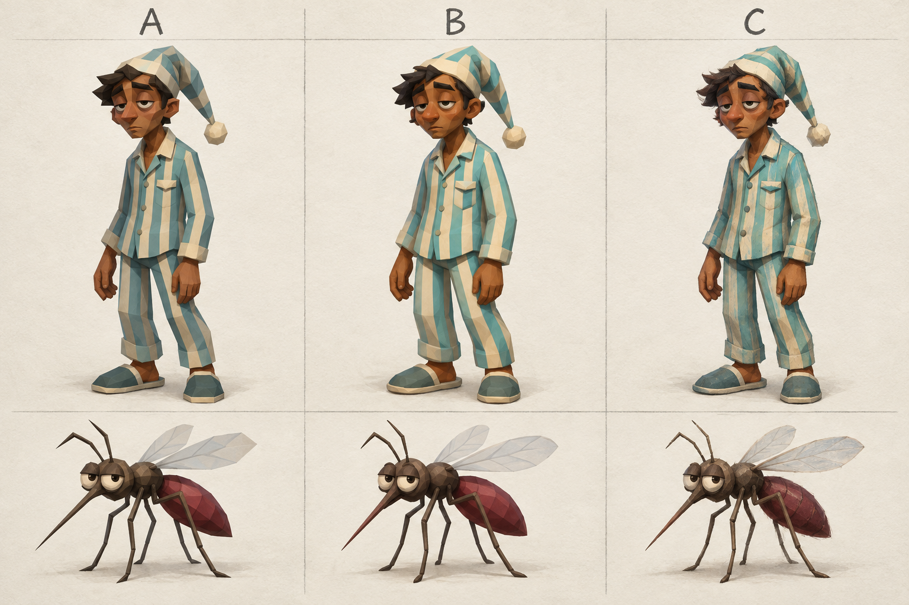
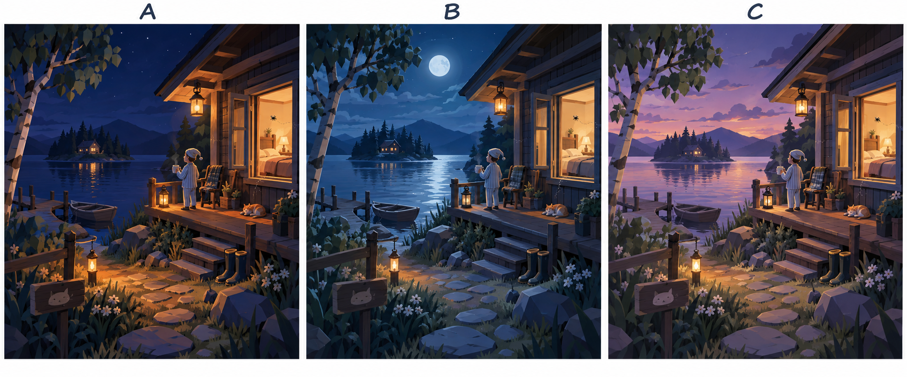

# Let Me Sleep — 150 decisiones para definir v0.2.0

Versión 1 · 20/09/2026. Ninguna opción está aprobada ni preseleccionada. Las cifras propuestas se convierten en balance inicial sólo tras tu elección y pruebas.

**Cómo responder:** `P01=A`, `J21=A+B` cuando admite varias, o `A01=Mi alternativa: ...`. También `J02=CEO, priorizá sesiones cortas`. Dejar pendiente no aprueba una recomendación. Una nota sola tampoco.

## Acuerdos conservados

- Windows v0.2.0 en Unity; entrega completa y publicada en GitHub con launcher compatible.
- Cinco mapas fijos: Isla del Laguito, Casa del Patio, Campamento Pinar, Yate a la Deriva y Puerto del Faro.
- Tres modos: Sangre, Supervivencia y Tareas; entrenamiento con bots y ambos roles.
- Humano en primera persona con cuerpo visible; mosquito en tercera persona y W hacia la mirada.
- Roles sorteados por ronda; sin proporción obligatoria 2:1.
- Defensa manual y picadura sin marcas; inventario de tres espacios con manos fuera de slots.
- Tres vidas personales de mosquito en Tareas, objetivos privados y respawn protegido.
- Voz por PTT; mute detiene captura; no cambiar micrófono sin consentimiento.
- Sala privada por código y cierre al salir el anfitrión; ninguna propuesta aquí añade migración de host automáticamente.
- Arte nuevo sin reciclar estética alfa; fuentes Higgsfield preservadas; bocetos nuevos son exploratorios.
- Sin crafting, armas de fuego, clases con estadísticas, tienda, recompensas diarias ni minimapa.
- Pruebas CPU no certifican arte, audio, WAN o capacidad; la descarga final debe comprobarse.

## Bocetos de comparación

Exploraciones generadas con imagegen; no son capturas de Unity, arte aprobado ni modelos Higgsfield. La geometría final deberá respetar los mapas existentes.

A: facetado; B: suave; C: mixto pintado. Usar con A01/A02.

A: noche cálida; B: luna fría; C: crepúsculo. Usar con A23/A24; Isla sigue diurna. HUD y cámara tienen esquemas adicionales en index.html.

## Identidad y experiencia

### P01 · ¿Qué sensación debería dominar una buena partida entre amigos?

**Decisiva · Elegí una · Por definir.**

Orienta el ritmo y la presentación sin cambiar los roles ni los tres modos acordados.

**Ejemplo:** Imaginate contar la partida: «Nos reímos del susto», «Casi nos descubren» o «Ganamos por coordinarnos».

- **A · Comedia de situación** — Errores y escapes divertidos; celebraciones breves y expresivas.
- **B · Tensión ligera** — Momentos tranquilos que hacen más intenso un encuentro; menos festejos durante la ronda.
- **C · Cooperación competitiva** — Que se entiendan las decisiones del equipo y por qué funcionaron; presentación más sobria.

**Tu respuesta:** ___  | **Notas o alternativa:** ___

Contexto: `docs/ceo/V0.2.0-DELIVERY.md`. El texto histórico no crea una orden nueva.

### P02 · ¿Qué tono deberían tener los textos del juego?

**Detalle · Elegí una · Valor provisional en código.**

Define una voz consistente para botones, ayudas y errores.

**Ejemplo:** Al quedar eliminado: «Se terminó tu vuelo», «Eliminado: observá a tu equipo» o «Eliminado. Tab: siguiente aliado».

- **A · Cercano con humor discreto** — Frases cálidas fuera del combate; instrucciones literales cuando hay que actuar.
- **B · Claro y conversacional** — Español rioplatense directo, sin bromas que tapen una instrucción.
- **C · Breve y neutral** — Mensajes de pocas palabras; menos personalidad y lectura más rápida.

**Tu respuesta:** ___  | **Notas o alternativa:** ___

Contexto: `unity/Assets/LetMeSleep/UI/Runtime/AlfaUiController.cs`. El texto histórico no crea una orden nueva.

### P03 · ¿Qué debería destacar la primera pantalla para un amigo nuevo?

**Decisiva · Elegí una · Valor provisional en código.**

Todos conservan acceso a jugar, entrenar y ajustes; cambia la jerarquía visual.

**Ejemplo:** Boceto: una tarjeta central grande y dos accesos secundarios debajo.

- **A · Entrar con amigos** — Unirse con código es la tarjeta principal; entrenamiento queda a un clic.
- **B · Prepararse para jugar** — Entrenamiento ocupa la tarjeta principal en el primer inicio; luego se recuerda jugar online.
- **C · Elegir sin preferencia** — Crear, unirse y entrenar aparecen con igual tamaño; hay más decisiones de entrada.

**Tu respuesta:** ___  | **Notas o alternativa:** ___

Contexto: `unity/Assets/LetMeSleep/UI/Runtime/AlfaUiController.cs`. El texto histórico no crea una orden nueva.

### P04 · ¿Cómo debería aprender alguien su rol la primera vez?

**Decisiva · Elegí una · Por definir.**

Define la ayuda inicial; no cambia que los roles online se sorteen cada ronda.

**Ejemplo:** Un amigo entra por primera vez como mosquito y necesita entender vuelo, posarse y picar.

- **A · Tarjeta de 20 segundos** — Tres controles esenciales antes de jugar, descartable de inmediato; aprendizaje durante la ronda.
- **B · Práctica guiada de 2 minutos** — Ofrecer tres pasos en entrenamiento antes de unirse; siempre se puede omitir.
- **C · Ayuda contextual** — Sin tarjeta inicial; una pista aparece al acercarse por primera vez a cada interacción.

**Tu respuesta:** ___  | **Notas o alternativa:** ___

Contexto: `docs/ceo/MODES-UI-DELIVERY.md`. El texto histórico no crea una orden nueva.

### P05 · ¿Cuándo deberían retirarse las ayudas para principiantes?

**Detalle · Elegí una · Por definir.**

Evita que las pistas permanentes molesten o que desaparezcan demasiado pronto.

**Ejemplo:** La pista de posarse aparece antes de usar F; después de varios intentos puede dejar de mostrarse.

- **A · Después del primer éxito** — La pista se retira al completar esa acción una vez; se recupera desde ayuda.
- **B · Después de tres éxitos** — Repite hasta tres usos correctos por acción; más apoyo durante la adaptación.
- **C · Cuando el jugador decida** — Permanecen hasta desactivar «Ayudas»; el control es explícito y el HUD más ocupado.

**Tu respuesta:** ___  | **Notas o alternativa:** ___

Contexto: `docs/ceo/MODES-UI-DELIVERY.md`. El texto histórico no crea una orden nueva.

### P06 · ¿Qué prioridad debe guiar la primera sesión de prueba con amigos?

**Decisiva · Elegí una · Por definir.**

Todos los requisitos de entrega siguen vigentes; esto ordena la sesión y la observación.

**Ejemplo:** Sesión propuesta de 30 minutos, con una meta clara para las notas de prueba.

- **A · Entrar y repetir sin fricción** — Medir desde código de sala hasta revancha; registrar cada espera o salida inesperada.
- **B · Entender lo que ocurre** — Observar si pueden explicar roles, acciones y resultados sin ayuda externa.
- **C · Sentir bien los controles** — Concentrarse en cámara, vuelo, superficies y defensa; registrar situaciones incómodas.

**Tu respuesta:** ___  | **Notas o alternativa:** ___

Contexto: `docs/ceo/V0.2.0-DELIVERY.md`. El texto histórico no crea una orden nueva.

### P07 · ¿Cómo se debería ofrecer ayuda después de una dificultad repetida?

**Decisiva · Elegí una · Por definir.**

Define acompañamiento sin alterar dificultad, daño ni información del rival.

**Ejemplo:** Un jugador falla tres intentos de posarse o no termina su primera tarea.

- **A · Consejo opcional discreto** — Mostrar una sola sugerencia breve tras tres intentos; nunca pausar.
- **B · Acceso a práctica al terminar** — Ofrecer repetir esa acción en entrenamiento desde resultados; no intervenir en combate.
- **C · Sólo ayuda solicitada** — No inferir errores; el jugador abre la guía cuando la necesita.

**Tu respuesta:** ___  | **Notas o alternativa:** ___

Contexto: `docs/ceo/MODES-UI-DELIVERY.md`. El texto histórico no crea una orden nueva.

### P08 · ¿Qué información debería acompañar el cambio de rol entre rondas?

**Detalle · Elegí una · Por definir.**

La asignación aleatoria permanece; se define cómo comunicar el cambio.

**Ejemplo:** Después de jugar humano, la siguiente ronda te asigna mosquito.

- **A · Tarjeta de rol durante 3 segundos** — Rol, objetivo del modo y tres controles; luego se desvanece.
- **B · Aviso compacto durante 1 segundo** — Nombre e icono del rol; ayuda completa disponible bajo demanda.
- **C · Tarjeta sólo al cambiar de rol** — Mostrar 3 segundos si el rol difiere del anterior; si se repite, aviso de 1 segundo.

**Tu respuesta:** ___  | **Notas o alternativa:** ___

Contexto: `docs/ceo/MODES-UI-DELIVERY.md`. El texto histórico no crea una orden nueva.

## Jugabilidad

### J01 · ¿Cómo debe gastar estamina el humano al correr?

**Decisiva · Elegí una · Por definir.**

Define cuánto puede escapar o rotar entre tareas sin convertir la carrera en movimiento permanente.

**Ejemplo:** Propuesta de referencia: con la barra llena, un humano cruza un pasillo durante 6 segundos a 5 m/s; luego vuelve a 3,1 m/s sin quedar inmóvil.

- **A · Consumo continuo** — Propuesta: 100 puntos, coste 16/s; permite unos 6,25 s de carrera completa y caminar siempre.
- **B · Ráfagas cortas** — Propuesta: 100 puntos, coste 25/s; unos 4 s de carrera, pensada para esquivas breves.
- **C · Aceleración progresiva** — El coste crece mientras se mantiene correr: barato al inicio y caro después de 3 s.

**Tu respuesta:** ___  | **Notas o alternativa:** ___

Propuesta del CEO, sin aprobar: A.

Contexto: `docs/ceo/V0.2.0-PLAN-REANUDACION.md`. El texto histórico no crea una orden nueva.

### J02 · ¿Cuándo y a qué ritmo se recupera la estamina humana?

**Decisiva · Elegí una · Por definir.**

El retardo de recuperación determina si perseguir, defender y cumplir tareas forma ciclos legibles o pausas frustrantes.

**Ejemplo:** Tras correr hasta cero, el jugador se esconde detrás de una puerta. ¿Cuánto tarda en volver a tener una carrera útil?

- **A · Pausa breve** — Propuesta: retardo de 1,25 s y recuperación de 22 puntos/s; de cero a lleno en 4,55 s.
- **B · Recuperación inmediata** — Propuesta: sin retardo y 14 puntos/s; suaviza el control pero favorece alternar carrera a pulsos.
- **C · Recuperación por postura** — Propuesta: 12/s caminando y 28/s quieto o agachado; premia detenerse de forma visible.

**Tu respuesta:** ___  | **Notas o alternativa:** ___

Propuesta del CEO, sin aprobar: A.

Contexto: `docs/unity/PLAN-UNITY-0.9.4.md`. El texto histórico no crea una orden nueva.

### J03 · ¿Qué acciones humanas, además de correr, consumen estamina?

**Decisiva · Elegí una · Por definir.**

Evita que salto, golpes y herramientas exigentes tengan costes contradictorios o dejen al jugador sin defensa básica.

**Ejemplo:** Un humano llega sin estamina y un mosquito se posa cerca: la palmada básica debe seguir disponible, pero una cadena de saltos o raquetazos puede limitarse.

- **A · Salto y herramientas pesadas** — Propuesta: salto 12; raqueta/aerosol según recurso propio; palmada y matamoscas básico cuestan 0.
- **B · Sólo correr** — La barra nunca condiciona saltos ni defensa; las herramientas usan únicamente cooldown o munición.
- **C · Saltos y acciones cargadas** — Propuesta: salto 10 y lanzamiento cargado 8–15; manos y defensa básica siempre gratuitas, sin reservar una única palmada.

**Tu respuesta:** ___  | **Notas o alternativa:** ___

Propuesta del CEO, sin aprobar: A.

Contexto: `docs/ceo/V0.2.0-PLAN-REANUDACION.md`. El texto histórico no crea una orden nueva.

### J04 · ¿Qué sensación debe tener la aceleración y el freno del mosquito?

**Decisiva · Elegí una · Valor provisional en código.**

W ya sigue la mirada; faltan la inercia y la distancia de frenado que hacen al vuelo preciso o desafiante.

**Ejemplo:** Volando a 3,8 m/s hacia una pared, el jugador suelta W a un metro. La opción elegida decide si se detiene a tiempo o debe anticipar.

- **A · Ágil con freno fuerte** — Conservar propuesta actual: aceleración 13 m/s², frenado 28 m/s² y velocidad 3,8 m/s.
- **B · Inercia moderada** — Propuesta: aceleración 10, frenado 16 y velocidad 4,1 m/s; exige anticipar sin sentirse flotante.
- **C · Vuelo muy preciso** — Propuesta: aceleración 20, frenado 36 y velocidad 3,5 m/s; prioriza entrar por huecos pequeños.

**Tu respuesta:** ___  | **Notas o alternativa:** ___

Propuesta del CEO, sin aprobar: A.

Contexto: `unity/Assets/LetMeSleep/Gameplay/GameplayAuthority.cs`. El texto histórico no crea una orden nueva.

### J05 · ¿Cómo se activa y cancela el posado del mosquito?

**Decisiva · Elegí una · Valor provisional en código.**

El control debe distinguir intención de posarse, caminar por superficies y volver a volar sin enganches accidentales.

**Ejemplo:** El mosquito roza el marco de una puerta mientras persigue a alguien: ¿se posa sólo si pulsó la acción o por contacto automático?

- **A · Alternar con tecla** — Una pulsación busca superficie; otra o saltar desprende. El roce normal no cambia de estado.
- **B · Mantener para adherir** — Se posa mientras la acción está sostenida y se desprende al soltar; reduce estados persistentes.
- **C · Contacto asistido** — Con velocidad baja se posa automáticamente; una tecla desactiva temporalmente la adhesión.

**Tu respuesta:** ___  | **Notas o alternativa:** ___

Propuesta del CEO, sin aprobar: A.

Contexto: `unity/Assets/LetMeSleep/Gameplay/Contracts.cs`. El texto histórico no crea una orden nueva.

### J06 · ¿Qué compromiso temporal debe exigir iniciar una picadura?

**Decisiva · Elegí una · Valor provisional en código.**

La preparación define la ventana de reacción humana antes de que empiece la extracción.

**Ejemplo:** Un mosquito consigue contacto válido en un brazo. Con 0,6 s de preparación el humano ve y oye la amenaza antes de que la sangre progrese.

- **A · Preparación de 0,6 s** — Conservar el valor provisional; soltar, perder contacto o recibir golpe cancela y obliga a preparar otra vez.
- **B · Preparación de 0,35 s** — Ataque más inmediato; requiere señales muy claras y favorece al mosquito en encuentros cortos.
- **C · Preparación variable** — Propuesta: 0,45 s en zonas expuestas y 0,8 s en espalda; añade balance según superficie sin marcas visuales.

**Tu respuesta:** ___  | **Notas o alternativa:** ___

Propuesta del CEO, sin aprobar: A.

Contexto: `unity/Assets/LetMeSleep/Gameplay/Contracts.cs`. El texto histórico no crea una orden nueva.

### J07 · ¿Cómo debe recuperarse un humano después del desmayo?

**Decisiva · Elegí una · Valor provisional en código.**

La duración y el control durante la recuperación determinan si el desmayo es una consecuencia clara o un bloqueo prolongado.

**Ejemplo:** La extracción se completa, el humano cae y aterriza. La propuesta actual inicia 12 s de recuperación desde el apoyo y añade 1,5 s de protección al levantarse.

- **A · 12 s más protección** — Conservar 12 s desde el aterrizaje, transición de 0,4 s y protección de 1,5 s al volver.
- **B · Recuperación corta** — Propuesta: 8 s y protección 2 s; reduce tiempo sin control y evita repicadura inmediata.
- **C · Recuperación activa** — Propuesta: base 14 s, reducible hasta 8 s con una secuencia simple; nunca afecta la defensa básica al despertar.

**Tu respuesta:** ___  | **Notas o alternativa:** ___

Propuesta del CEO, sin aprobar: A.

Contexto: `unity/Assets/LetMeSleep/Gameplay/Contracts.cs`. El texto histórico no crea una orden nueva.

### J08 · ¿Qué interacción gana cuando varios objetos están bajo la mirada?

**Decisiva · Elegí una · Por definir.**

Puertas, tareas, rescates y pickups pueden compartir una zona; una prioridad fija evita acciones sorpresivas.

**Ejemplo:** Un aliado caído está junto a una puerta y un aerosol. El jugador mantiene Usar: debe quedar claro si rescata, abre o recoge.

- **A · Contexto vital primero** — Prioridad propuesta: rescate > tarea activa > puerta > pickup; HUD muestra una sola acción elegida.
- **B · Centro de mirada** — Gana el collider más centrado y cercano, sin prioridad por categoría; máxima consistencia espacial.
- **C · Pulsar y mantener** — Pulsación usa puerta/pickup; mantener reserva rescate/tarea. Reduce ambigüedad a cambio de más aprendizaje.

**Tu respuesta:** ___  | **Notas o alternativa:** ___

Propuesta del CEO, sin aprobar: A.

Contexto: `docs/ceo/MODES-V020.md`. El texto histórico no crea una orden nueva.

## Modos

### J09 · ¿Qué duración base debe tener cada modo?

**Decisiva · Elegí una · Valor provisional en código.**

Una sola duración de 180 s existe hoy, pero los ritmos de Sangre, Supervivencia y Tareas son distintos.

**Ejemplo:** Una sala juega tres rondas seguidas. Con perfiles distintos, Sangre puede durar 3 min, Supervivencia 2,5 min y Tareas 4 min.

- **A · Duración por modo** — Propuesta: Sangre 180 s, Supervivencia 150 s y Tareas 240 s; el host elige variantes dentro de límites.
- **B · Tres minutos para todos** — Conservar 180 s como base común; simplifica lobby, balance y aprendizaje.
- **C · Escala por población** — Propuesta: base 150 s más 10 s por participante desde el tercero, con tope de 300 s.

**Tu respuesta:** ___  | **Notas o alternativa:** ___

Propuesta del CEO, sin aprobar: A.

Contexto: `unity/Assets/LetMeSleep/Core/RoomSession.cs`. El texto histórico no crea una orden nueva.

### J10 · ¿Cómo escala la cuota de sangre con la población?

**Decisiva · Elegí una · Valor provisional en código.**

La cuota fija provisional de 20 puede ser trivial con muchos mosquitos o imposible con pocos.

**Ejemplo:** Con 1 humano y 1 mosquito la misma cuota no debería requerir el mismo número de contactos que con 5 humanos y 6 mosquitos.

- **A · Escala por humanos** — Propuesta: 12 unidades base + 6 por humano; 18 con uno y 42 con cinco.
- **B · Cuota fija 20** — Conservar el valor actual en todas las salas y ajustar sólo tiempo/extracción.
- **C · Escala por ambos equipos** — Propuesta: 10 + 5 por humano + 2 por mosquito, con tope de 50.

**Tu respuesta:** ___  | **Notas o alternativa:** ___

Propuesta del CEO, sin aprobar: A.

Contexto: `unity/Assets/LetMeSleep/Gameplay/Contracts.cs`. El texto histórico no crea una orden nueva.

### J11 · ¿Cómo contribuyen varios mosquitos que pican al mismo humano?

**Decisiva · Elegí una · Valor provisional en código.**

La regla determina si concentrarse en una víctima es cooperación válida o una explosión de progreso imposible de defender.

**Ejemplo:** Tres mosquitos pican al mismo humano durante 2 s. El código actual reparte una tasa total, de modo que no triplican el desmayo ni la sangre.

- **A · Tasa total compartida** — Conservar el reparto actual: juntos aseguran continuidad, pero la víctima recibe como máximo una tasa completa.
- **B · Rendimiento decreciente** — Propuesta: 100% + 40% + 20% para los tres primeros; coopera sin triplicar.
- **C · Suma completa** — Cada mosquito aporta 100%; favorece ataques coordinados y exige fuerte contrajuego humano.

**Tu respuesta:** ___  | **Notas o alternativa:** ___

Propuesta del CEO, sin aprobar: A.

Contexto: `unity/Assets/LetMeSleep/Gameplay/GameplayAuthority.cs`. El texto histórico no crea una orden nueva.

### J12 · ¿Cómo se distribuyen las herramientas en Supervivencia?

**Decisiva · Elegí una · Por definir.**

La eliminación de un solo impacto vuelve decisivo el acceso humano a herramientas; su reposición puede inclinar toda la ronda.

**Ejemplo:** Un humano toma la única raqueta y luego la deja en una zona peligrosa. Falta decidir si el equipo debe recuperarla físicamente o si reaparece.

- **A · Pickups finitos por ronda** — Los objetos quedan donde se sueltan y no reaparecen; el equipo debe administrarlos y recuperarlos.
- **B · Reposición a 45 s** — Un objeto abandonado o perdido vuelve a su soporte tras 45 s si nadie lo lleva.
- **C · Sólo defensa básica** — Supervivencia deshabilita herramientas y se balancea únicamente con manos y movimiento.

**Tu respuesta:** ___  | **Notas o alternativa:** ___

Propuesta del CEO, sin aprobar: A.

Contexto: `docs/ceo/MODES-V020.md`. El texto histórico no crea una orden nueva.

### J13 · ¿Qué cadencia y plazo inicial deben usar las tareas personales?

**Decisiva · Elegí una · Valor provisional en código.**

Cadencia y plazo fijan cuántas oportunidades caben y cuánto tiempo real queda para desplazarse y trabajar.

**Ejemplo:** Los valores provisionales emiten una oportunidad cada 40 s, con 30 s de plazo inicial y un mínimo posterior de 15 s.

- **A · 40/30/15 segundos** — Conservar cadencia 40 s, plazo 30 s y mínimo 15 s; trabajo y ruta deben caber dentro.
- **B · 45/35/20 segundos** — Más margen y menos oportunidades; apropiado para mapas grandes o jugadores nuevos.
- **C · 35/25/12 segundos** — Más presión y rotación; requiere objetivos cercanos y tareas cortas.

**Tu respuesta:** ___  | **Notas o alternativa:** ___

Propuesta del CEO, sin aprobar: A.

Contexto: `unity/Assets/LetMeSleep/Gameplay/ModeRules.cs`. El texto histórico no crea una orden nueva.

### J14 · ¿Qué porcentaje de oportunidades debe exigir la meta compartida de Tareas?

**Decisiva · Elegí una · Valor provisional en código.**

La meta decide cuántos fallos personales puede absorber el equipo antes de perder.

**Ejemplo:** Si hay 12 oportunidades viables, la fórmula actual exige 8 completadas; 4 pueden fallar sin perder automáticamente.

- **A · Dos tercios** — Conservar ceil(2/3): 8 de 12. Tolera fallos sin volver irrelevantes a los mosquitos.
- **B · Tres cuartos** — Propuesta: ceil(75%): 9 de 12. Hace cada interrupción más valiosa.
- **C · Escala por dificultad** — Propuesta: 60% fácil, 67% normal y 75% difícil; añade una opción visible de sala.

**Tu respuesta:** ___  | **Notas o alternativa:** ___

Propuesta del CEO, sin aprobar: A.

Contexto: `unity/Assets/LetMeSleep/Gameplay/ModeRules.cs`. El texto histórico no crea una orden nueva.

### J15 · ¿Puede recuperarse el plazo personal después de completar tareas?

**Decisiva · Elegí una · Valor provisional en código.**

Hoy cada fallo resta 3 s hasta el mínimo y los aciertos no restauran margen; eso puede crear una espiral irreversible.

**Ejemplo:** Una persona falla dos veces: su plazo baja de 30 a 24 s. Luego completa dos tareas seguidas. ¿Sigue en 24 o recupera tiempo?

- **A · Recupera un escalón** — Propuesta: cada acierto devuelve 3 s, hasta el plazo inicial; premia recomponerse.
- **B · No recupera** — Conservar el código provisional: los fallos acumulados duran toda la ronda.
- **C · Racha de dos** — Recupera 3 s sólo tras dos aciertos consecutivos; mantiene presión con salida gradual.

**Tu respuesta:** ___  | **Notas o alternativa:** ___

Propuesta del CEO, sin aprobar: A.

Contexto: `unity/Assets/LetMeSleep/Gameplay/ModeRules.cs`. El texto histórico no crea una orden nueva.

### J16 · ¿Cuánta protección recibe un mosquito al reaparecer en Tareas?

**Decisiva · Elegí una · Valor provisional en código.**

Las tres vidas están fijadas; falta impedir que una vida nueva se pierda antes de recuperar control sin permitir atacar invulnerable.

**Ejemplo:** El mosquito reaparece cerca de un humano tras perder una vida. Durante la protección puede alejarse, pero no debería iniciar una picadura segura.

- **A · 1,5 s sin atacar** — Conservar 1,5 s de protección y bloquear picadura/ayuda hasta que termine o el mosquito actúe.
- **B · 2,5 s cancelables** — Más margen para mapas abiertos; moverse no cancela, pero picar o posarse sí.
- **C · 1 s y mayor separación** — Protección breve, con punto seguro más alejado; ninguna acción ofensiva puede aprovechar invulnerabilidad.

**Tu respuesta:** ___  | **Notas o alternativa:** ___

Propuesta del CEO, sin aprobar: A.

Contexto: `unity/Assets/LetMeSleep/Gameplay/Contracts.cs`. El texto histórico no crea una orden nueva.

## Reglas por cerrar

### D01 · ¿Cómo elige el anfitrión la composición humana/mosquito?

**Decisiva · Elegí una · Por definir.**

Roles se sortean cada ronda y no hay proporción fija 2:1; se precisa la interfaz de cantidad.

**Ejemplo:** Con seis personas, el host quiere probar dos humanos y cuatro mosquitos.

- **A · Cantidad humana explícita** — Host elige entre 1 y N−1 humanos; UI muestra resto como mosquitos.
- **B · Presets editables** — Composiciones sugeridas por tamaño más ajuste numérico.
- **C · Cantidad automática revisable** — Proponer una composición equilibrada, host puede cambiar antes de listo.

**Tu respuesta:** ___  | **Notas o alternativa:** ___

Propuesta del CEO, sin aprobar: B.

Contexto: `docs/unity/PLAN-UNITY-0.9.4.md (cantidades históricas propuestas, no aprobadas); docs/ceo/V0.2.0-PLAN-REANUDACION.md`. El texto histórico no crea una orden nueva.

### D02 · ¿Qué variedad de acciones tendrán las tareas?

**Decisiva · Elegí una · Por definir.**

Se conservan objetivos privados y accesibles; la interacción concreta sigue abierta.

**Ejemplo:** Limpiar una mesa, reparar una lámpara o accionar un interruptor.

- **A · Mantener una tecla** — Diferencia por objeto, duración y animación; control consistente.
- **B · Mantener y accionar** — Tareas largas al mantener y acciones cortas de un toque.
- **C · Dos gestos sencillos** — Mantener y una secuencia breve sin pulsaciones frenéticas; explicar cada gesto.

**Tu respuesta:** ___  | **Notas o alternativa:** ___

Propuesta del CEO, sin aprobar: A.

Contexto: `docs/unity/PLAN-UNITY-0.9.4.md (cantidades históricas propuestas, no aprobadas); docs/ceo/V0.2.0-PLAN-REANUDACION.md`. El texto histórico no crea una orden nueva.

### D03 · ¿Cuántos puntos de tarea distintos queremos por mapa?

**Decisiva · Elegí una · Por definir.**

Un solo punto por mapa no proporciona variedad ni reparto suficiente; cantidad depende de población y rutas.

**Ejemplo:** Cinco humanos reciben tareas que no deberían amontonarse siempre en el mismo lugar.

- **A · Mínimo diez puntos** — Dos alternativas por humano a cinco humanos, distribuido entre zonas.
- **B · Mínimo quince puntos** — Más variedad por ronda y mejor reparto; más authoring y validación.
- **C · Cantidad por zonas** — Al menos dos por zona jugable principal, con mínimo diez por mapa.

**Tu respuesta:** ___  | **Notas o alternativa:** ___

Propuesta del CEO, sin aprobar: A.

Relacionada con O02.

Contexto: `docs/unity/PLAN-UNITY-0.9.4.md (cantidades históricas propuestas, no aprobadas); docs/ceo/V0.2.0-PLAN-REANUDACION.md`. El texto histórico no crea una orden nueva.

### D04 · ¿Qué progreso conserva una tarea si la interrumpen?

**Decisiva · Elegí una · Por definir.**

Defenderse no debería generar una penalidad invisible.

**Ejemplo:** Vas por 70 %, soltás la tecla para espantar un mosquito y volvés.

- **A · Conserva con pérdida gradual** — Breve gracia y luego baja lentamente; valores concretos se prueban.
- **B · Conserva hasta vencer** — El porcentaje queda hasta el plazo; reduce castigo por defenderse.
- **C · Pierde un tramo fijo** — Cada interrupción válida resta una fracción anunciada, nunca oculta.

**Tu respuesta:** ___  | **Notas o alternativa:** ___

Propuesta del CEO, sin aprobar: A.

Contexto: `docs/unity/PLAN-UNITY-0.9.4.md (cantidades históricas propuestas, no aprobadas); docs/ceo/V0.2.0-PLAN-REANUDACION.md`. El texto histórico no crea una orden nueva.

### D05 · ¿Cuánto se acorta el plazo personal al fallar una tarea?

**Decisiva · Elegí una · Por definir.**

Afecta sólo a esa persona y respeta el mínimo elegido en J13; no acorta la ronda.

**Ejemplo:** Plazo de 30 s: una pérdida de 5 s deja la siguiente tarea en 25 s.

- **A · Cinco segundos** — Penalidad lineal fácil de explicar, hasta el mínimo.
- **B · Tres segundos** — Escalada más suave para grupos nuevos.
- **C · Diez por ciento del inicial** — Se adapta al preset, redondeado y explicado en HUD.

**Tu respuesta:** ___  | **Notas o alternativa:** ___

Propuesta del CEO, sin aprobar: A.

Relacionada con J13.

Contexto: `docs/unity/PLAN-UNITY-0.9.4.md (cantidades históricas propuestas, no aprobadas); docs/ceo/V0.2.0-PLAN-REANUDACION.md`. El texto histórico no crea una orden nueva.

### D06 · ¿Cuánto tarda el rescate de un mosquito aliado?

**Decisiva · Elegí una · Por definir.**

Debe haber oportunidad de intervenir y riesgo claro, sin ayuda instantánea o interminable.

**Ejemplo:** Un aliado se acerca al caído mientras el humano busca dónde cayó.

- **A · Dos segundos continuos** — Tiempo corto con cancelación al alejarse o recibir impacto.
- **B · Tres segundos continuos** — Más compromiso; requiere buena cobertura.
- **C · Uno y medio segundos** — Rescate rápido, mayor presión al humano para impedirlo.

**Tu respuesta:** ___  | **Notas o alternativa:** ___

Propuesta del CEO, sin aprobar: A.

Contexto: `docs/unity/PLAN-UNITY-0.9.4.md (cantidades históricas propuestas, no aprobadas); docs/ceo/V0.2.0-PLAN-REANUDACION.md`. El texto histórico no crea una orden nueva.

### D07 · ¿Qué esquema inicial de teclas preferís para inventario e interacción?

**Decisiva · Elegí una · Por definir.**

Siempre será reasignable; define el tutorial y conflicto con voz.

**Ejemplo:** Manos fuera de slots: 1/2/3 seleccionan objetos y otra tecla vuelve a manos.

- **A · Números y E** — 1/2/3 slots, 4 manos, E interactuar, G soltar; PTT aparte.
- **B · Rueda más números** — Rueda recorre manos y slots, números directos; E interactuar.
- **C · Teclas cercanas** — Q alterna manos/objeto, rueda slots y E interactuar; números alternativos.

**Tu respuesta:** ___  | **Notas o alternativa:** ___

Propuesta del CEO, sin aprobar: B.

Contexto: `docs/unity/PLAN-UNITY-0.9.4.md (cantidades históricas propuestas, no aprobadas); docs/ceo/V0.2.0-PLAN-REANUDACION.md`. El texto histórico no crea una orden nueva.

### D08 · ¿Qué equipo de entrada debe quedar listo para v0.2.0?

**Decisiva · Elegí una · Por definir.**

Precisa aceptación de controles sin confundir una opción de menú con soporte real.

**Ejemplo:** Un amigo usa teclado y ratón; otro quiere conectar mando.

- **A · Teclado y ratón completos** — Reasignación y sensibilidad por rol; mando queda fuera de esta entrega.
- **B · Teclado/ratón y mando** — Ambos completos en menú, gameplay y voz; mayor alcance de QA.
- **C · Teclado/ratón más remapeo accesible** — Priorizar una mano/remapeo completo y mantener/alternar acciones permitidas; sin mando ahora.

**Tu respuesta:** ___  | **Notas o alternativa:** ___

Propuesta del CEO, sin aprobar: A.

Contexto: `docs/unity/PLAN-UNITY-0.9.4.md (cantidades históricas propuestas, no aprobadas); docs/ceo/V0.2.0-PLAN-REANUDACION.md`. El texto histórico no crea una orden nueva.

## Inventario y herramientas

### J17 · ¿Qué ocurre al recoger un objeto con los tres slots ocupados?

**Decisiva · Elegí una · Por definir.**

Debe existir una regla autoritativa que evite duplicados y pérdidas accidentales.

**Ejemplo:** El jugador lleva matamoscas, diario y aerosol, mira una raqueta y pulsa recoger.

- **A · Intercambiar slot activo** — Suelta de forma segura el objeto activo y ocupa ese slot; muestra una confirmación breve antes de ejecutar.
- **B · Rechazar recogida** — No cambia nada; el HUD indica Inventario lleno y obliga a soltar primero.
- **C · Elegir slot** — Abre un selector radial de los tres slots; el objeto elegido se suelta si hay espacio físico.

**Tu respuesta:** ___  | **Notas o alternativa:** ___

Propuesta del CEO, sin aprobar: A.

Contexto: `docs/ceo/V0.2.0-PLAN-REANUDACION.md`. El texto histórico no crea una orden nueva.

### J18 · ¿Cómo se seleccionan slots y manos durante una acción?

**Decisiva · Elegí una · Por definir.**

Cambiar equipo en mitad de un golpe, carga o aerosol necesita una cancelación predecible.

**Ejemplo:** El jugador está cargando un lanzamiento con botón derecho y pulsa el slot 2 o la tecla de manos.

- **A · Cambio cancela acción** — 1–3 seleccionan slots y una tecla vuelve a manos; cambiar cancela carga sin lanzar ni gastar recurso.
- **B · Cambio bloqueado** — No permite cambiar hasta terminar o cancelar explícitamente la acción actual.
- **C · Cola de cambio** — Registra la selección y la aplica al terminar la animación; fluido pero menos inmediato.

**Tu respuesta:** ___  | **Notas o alternativa:** ___

Propuesta del CEO, sin aprobar: A.

Contexto: `docs/unity/PLAN-UNITY-0.9.4.md`. El texto histórico no crea una orden nueva.

### J19 · ¿Cómo se suelta una herramienta sin convertir soltar en lanzamiento?

**Decisiva · Elegí una · Valor provisional en código.**

El drop debe ser reproducible en red, no atravesar paredes ni confundirse con un proyectil ofensivo.

**Ejemplo:** Frente a una mesa, el jugador pulsa soltar con un matamoscas; el host debe hallar una pose libre o rechazar la acción.

- **A · Depositar delante** — Coloca a 0,6–1 m sobre el primer soporte libre; si no hay espacio, conserva el objeto.
- **B · Caída física corta** — Aparece junto a la mano con velocidad mínima y se asienta por física autoritativa.
- **C · Volver a origen** — Regresa al punto authored del mapa; máxima seguridad, menor naturalidad.

**Tu respuesta:** ___  | **Notas o alternativa:** ___

Propuesta del CEO, sin aprobar: A.

Contexto: `unity/Assets/LetMeSleep/Gameplay/GameplayAuthority.cs`. El texto histórico no crea una orden nueva.

### J20 · ¿Qué ventaja concreta ofrece el matamoscas frente a las manos?

**Decisiva · Elegí una · Valor provisional en código.**

Ya existe como herramienta, pero necesita un intercambio de alcance, área y cadencia que no vuelva inútil la defensa manual.

**Ejemplo:** El código provisional mide 36,5 cm del agarre al impacto y cabeza de 8,5 cm; falta decidir qué sacrifica por ese alcance.

- **A · Más alcance, más lento** — Propuesta: +35% alcance, ventana/cooldown 25% más largos y área moderada.
- **B · Más área, mismo alcance** — Facilita acertar lateralmente, pero no alcanza zonas que las manos no puedan defender.
- **C · Golpe fuerte comprometido** — Derribo más largo a cambio de carga visible de 0,45 s y recuperación lenta.

**Tu respuesta:** ___  | **Notas o alternativa:** ___

Propuesta del CEO, sin aprobar: A.

Contexto: `unity/Assets/LetMeSleep/Gameplay/Contracts.cs`. El texto histórico no crea una orden nueva.

### J21 · ¿Qué objetos pueden lanzarse con carga?

**Decisiva · Elegí varias · Por definir.**

El plan exige lanzamiento sólo donde corresponda; la lista debe ser cerrada para animación, red y balance.

**Ejemplo:** Mantener botón derecho muestra potencia y soltar lanza. Un aerosol o una raqueta no deberían comportarse como una pantufla por accidente.

- **A · Pantufla** — Arrojable recuperable, arco medio y golpe de precisión; propuesta principal.
- **B · Diario enrollado** — Arrojable más pesado y corto; queda en el suelo y debe recogerse.
- **C · Matamoscas** — Permitir lanzarlo añade riesgo de perder la herramienta de mayor alcance; no propuesto por defecto.

**Tu respuesta:** ___  | **Notas o alternativa:** ___

Propuesta del CEO, sin aprobar: A.

Contexto: `docs/unity/PLAN-UNITY-0.9.4.md`. El texto histórico no crea una orden nueva.

### J22 · ¿Cómo se traduce la carga en potencia de lanzamiento?

**Decisiva · Elegí una · Por definir.**

Necesita límites legibles para que latencia y FPS no cambien alcance ni daño.

**Ejemplo:** Una carga corta sirve a dos metros; una completa cruza una habitación, pero deja una ventana de recuperación.

- **A · Carga de 0,9 s** — Propuesta: mínimo 35%, máximo a 0,9 s, curva suave y autoestabilización hasta 1,5 s.
- **B · Tres escalones** — Toque, media y completa a 0/0,5/1 s; fácil de leer y sincronizar.
- **C · Potencia fija** — Mantener sólo apunta y soltar lanza siempre igual; sacrifica expresión por consistencia.

**Tu respuesta:** ___  | **Notas o alternativa:** ___

Propuesta del CEO, sin aprobar: A.

Contexto: `docs/ceo/V0.2.0-PLAN-REANUDACION.md`. El texto histórico no crea una orden nueva.

### J23 · ¿Qué recurso y efecto usa la raqueta eléctrica?

**Decisiva · Elegí una · Por definir.**

Debe diferenciarse del matamoscas sin convertirse en defensa automática continua.

**Ejemplo:** El jugador activa la raqueta cerca de un mosquito: falta decidir si gasta una carga por golpe o energía mientras está encendida.

- **A · Pulsos con batería** — Propuesta: 5 cargas, un pulso de 0,35 s y cooldown 1,2 s; recarga sólo al reaparecer el pickup.
- **B · Energía continua** — Propuesta: 6 s encendida por batería y recarga lenta al estar guardada; exige proximidad sostenida.
- **C · Cooldown sin batería** — Uso ilimitado con cooldown de 2,5 s; menos gestión de inventario, más predecible.

**Tu respuesta:** ___  | **Notas o alternativa:** ___

Propuesta del CEO, sin aprobar: A.

Contexto: `docs/unity/PLAN-UNITY-0.9.4.md`. El texto histórico no crea una orden nueva.

### J24 · ¿Cómo funciona el aerosol y dónde se repone?

**Decisiva · Elegí una · Por definir.**

Área, duración y recurso determinan si es control de espacio o una eliminación segura desde lejos.

**Ejemplo:** Un humano rocía una puerta durante una persecución. El mosquito debería poder ver/oir la nube y rodearla, no recibir un impacto invisible.

- **A · Nube corta consumible** — Propuesta: 4 s totales por envase, cono 2 m, nube 1,2 s; no se repone hasta nueva ronda o pickup.
- **B · Ráfagas recargables** — Propuesta: 3 cargas; cada una vuelve en 20 s mientras el aerosol está guardado.
- **C · Repelente sin derribo** — No elimina: fuerza desprendimiento y bloquea picadura 2 s; 6 usos por envase.

**Tu respuesta:** ___  | **Notas o alternativa:** ___

Propuesta del CEO, sin aprobar: A.

Contexto: `docs/unity/PLAN-UNITY-0.9.4.md`. El texto histórico no crea una orden nueva.

## Bots

### J25 · Además del entrenamiento obligatorio, ¿dónde permitimos bots?

**Decisiva · Elegí una · Por definir.**

Entrenamiento los necesita, pero añadirlos automáticamente a salas privadas cambia expectativas y balance entre amigos.

**Ejemplo:** Dos amigos crean una sala para probar 2 humanos contra 2 mosquitos: ¿el juego completa los dos puestos faltantes sin pedirlo?

- **A · Sólo entrenamiento** — Entrenamiento completo con bots; sala privada sólo con personas.
- **B · Sala privada opcional** — El host habilita bots visibles y cantidad; entrenamiento siempre disponible.
- **C · Sala y reemplazo temporal** — Lo anterior más sustitución visible ante desconexiones, coherente con O08 y sin exponer datos privados.

**Tu respuesta:** ___  | **Notas o alternativa:** ___

Propuesta del CEO, sin aprobar: A.

Contexto: `docs/unity/PLAN-UNITY-0.9.4.md`. El texto histórico no crea una orden nueva.

### J26 · ¿Qué niveles de dificultad de bots deben existir en v0.2.0?

**Decisiva · Elegí una · Por definir.**

La dificultad debe modificar reacción y decisión, nunca percepción omnisciente ni reglas físicas.

**Ejemplo:** Un mosquito cruza una puerta y deja de verse. Un bot difícil puede recordar la dirección unos segundos, pero no conocer su posición detrás de paredes.

- **A · Normal único** — Un perfil verificable para publicar; reacción propuesta 250–400 ms y mismos permisos que jugadores.
- **B · Fácil y normal** — Fácil reacciona 500–700 ms y falla más; normal conserva 250–400 ms.
- **C · Tres niveles** — Fácil/normal/difícil cambian reacción, puntería y prioridades, con más matriz de balance.

**Tu respuesta:** ___  | **Notas o alternativa:** ___

Propuesta del CEO, sin aprobar: A.

Contexto: `docs/unity/gameplay/ACCEPTANCE.md`. El texto histórico no crea una orden nueva.

### J27 · ¿Cuánto dura la memoria de un objetivo que salió de vista?

**Decisiva · Elegí una · Por definir.**

Sin memoria los bots olvidan de inmediato; con demasiada parecen atravesar paredes con información.

**Ejemplo:** El humano ve al mosquito entrar detrás de un sofá. Puede investigar la última posición, pero debe perderlo si no vuelve a verlo.

- **A · Memoria de 3 s** — Recuerda última posición y dirección durante 3 s; después vuelve a patrulla sin actualizar datos ocultos.
- **B · Memoria de 1 s** — Muy reactivo a oclusión; permite escapes fáciles alrededor de muebles.
- **C · Memoria de 6 s** — Persecución más firme, con mayor riesgo de parecer omnisciente en interiores.

**Tu respuesta:** ___  | **Notas o alternativa:** ___

Propuesta del CEO, sin aprobar: A.

Contexto: `docs/unity/gameplay/ACCEPTANCE.md`. El texto histórico no crea una orden nueva.

### J28 · ¿Cómo prioriza un bot humano su tarea frente a un mosquito visible?

**Decisiva · Elegí una · Valor provisional en código.**

En Tareas debe cumplir su asignación privada y defenderse sin abandonar siempre el objetivo ni ignorar peligro inmediato.

**Ejemplo:** Le faltan 20 ticks para limpiar y aparece un mosquito a 1,5 m. ¿Termina, interrumpe o decide según riesgo?

- **A · Defensa por amenaza** — Interrumpe si el mosquito está a menos de 2 m, se acerca o ya pica; luego retoma progreso conservado.
- **B · Tarea hasta contacto** — Sólo interrumpe al recibir picadura o golpe; maximiza meta pero parece poco humano.
- **C · Margen de finalización** — Si resta menos de 20% termina; de otro modo se defiende ante amenaza cercana.

**Tu respuesta:** ___  | **Notas o alternativa:** ___

Propuesta del CEO, sin aprobar: A.

Contexto: `unity/Assets/LetMeSleep/Gameplay/BotController.cs`. El texto histórico no crea una orden nueva.

### J29 · ¿Cómo elige víctima un bot mosquito cuando ve varios humanos?

**Decisiva · Elegí una · Valor provisional en código.**

La selección afecta concentración de ataques, legibilidad y si siempre castiga al mismo jugador.

**Ejemplo:** Ve un humano cercano alerta, otro más lejos haciendo una tarea y un tercero casi desmayado.

- **A · Puntuación de oportunidad** — Propuesta: distancia, línea libre, tarea activa y ataques recientes; penaliza repetir víctima durante 8 s.
- **B · Más cercano** — Conservar selección simple por distancia visible; fácil de entender y probar.
- **C · Más vulnerable** — Prioriza quien está ocupado o con menor capacidad de defensa; más competitivo, menos casual.

**Tu respuesta:** ___  | **Notas o alternativa:** ___

Propuesta del CEO, sin aprobar: A.

Contexto: `unity/Assets/LetMeSleep/Gameplay/BotController.cs`. El texto histórico no crea una orden nueva.

### J30 · ¿Hasta qué punto usan puertas y herramientas los bots humanos?

**Decisiva · Elegí una · Por definir.**

Sin estas interacciones pueden atascarse o no representar una partida real; usar todo aumenta complejidad y riesgo.

**Ejemplo:** La ruta a una tarea cruza una puerta cerrada y hay un matamoscas en una mesa lateral.

- **A · Puertas y herramienta cercana** — Abre rutas necesarias y recoge una herramienta si el desvío es menor a 4 m y tiene slot libre.
- **B · Sólo puertas** — Completa navegación y tareas; combate siempre con manos para reducir variables.
- **C · Catálogo completo** — Evalúa slots, recursos, lanzamientos y aerosol como un jugador; requiere balance y pruebas mucho mayores.

**Tu respuesta:** ___  | **Notas o alternativa:** ___

Propuesta del CEO, sin aprobar: A.

Contexto: `unity/Assets/LetMeSleep/Gameplay/BotPatrol.cs`. El texto histórico no crea una orden nueva.

### J31 · ¿Cuándo debe un bot mosquito rescatar a un aliado caído?

**Decisiva · Elegí una · Valor provisional en código.**

El rescate conserva vidas en Tareas y recuperación en Sangre, pero agruparse puede regalar varias bajas.

**Ejemplo:** Un aliado está a 6 m y le quedan 4 s de ventana; un humano vigila el trayecto.

- **A · Riesgo y tiempo** — Rescata si puede llegar con 1,5 s de margen y no ve un humano a menos de 2,5 m del aliado.
- **B · Siempre rescata** — Prioridad absoluta al aliado alcanzable; comportamiento cooperativo y fácil de leer.
- **C · Sólo última vida** — En Tareas arriesga rescate únicamente si el aliado sería eliminado; en Sangre usa riesgo y tiempo.

**Tu respuesta:** ___  | **Notas o alternativa:** ___

Propuesta del CEO, sin aprobar: A.

Contexto: `unity/Assets/LetMeSleep/Gameplay/BotController.cs`. El texto histórico no crea una orden nueva.

### J32 · ¿Qué hace un bot cuando no progresa por una ruta durante varios segundos?

**Decisiva · Elegí una · Valor provisional en código.**

Debe recuperarse de puertas, muebles y rutas temporales sin teletransportarse ni empujar paredes indefinidamente.

**Ejemplo:** El bot avanza hacia un pasaje, pero su distancia no mejora durante 5 s por un objeto o actor que bloquea.

- **A · Replanificar y esperar** — A los 5 s marca el pasaje 6 s, busca otra ruta; si no existe, espera/patrulla la región y registra el atasco.
- **B · Retroceder y reintentar** — Retrocede 1 m, cambia ángulo y reintenta hasta tres veces antes de esperar.
- **C · Cancelar objetivo** — Abandona la persecución o tarea y solicita otra oportunidad no penalizante; reduce bloqueos, puede evadir contenido.

**Tu respuesta:** ___  | **Notas o alternativa:** ___

Propuesta del CEO, sin aprobar: A.

Contexto: `unity/Assets/LetMeSleep/Gameplay/BotPatrol.cs`. El texto histórico no crea una orden nueva.

## Arte y personajes

### A01 · ¿Qué tratamiento de formas querés para el humano nuevo?

**Decisiva · Elegí una · Por definir.**

Define la silueta y el modelado que se revisarán antes de producir variantes.

**Ejemplo:** Compará la fila superior de la lámina: mismo pijama, distinta construcción de cara y cuerpo.

- **A · Facetado marcado · A** — Planos visibles, nariz y mandíbula angulares; lectura muy gráfica.
- **B · Redondeado suave · B** — Rostro y ropa más suaves; conservar silueta adulta y detalles legibles.
- **C · Mixto pintado · C** — Cuerpo con planos y rostro más suave; textura sutil sin ruido.

**Tu respuesta:** ___  | **Notas o alternativa:** ___

Contexto: `Higgsfield/MAPAS-BOCETOS-20260913.md; Higgsfield/HUMANOS-INICIO.md; docs/ceo/V0.2.0-PLAN-REANUDACION.md`. El texto histórico no crea una orden nueva.

### A02 · ¿Qué tratamiento de formas querés para el mosquito?

**Decisiva · Elegí una · Por definir.**

Puede compartir materiales con el humano sin copiar exactamente sus proporciones.

**Ejemplo:** Compará la fila inferior; las alas y patas deberán verificarse después en 3D y movimiento.

- **A · Facetado marcado · A** — Abdomen y cabeza con planos definidos; alas geométricas.
- **B · Redondeado suave · B** — Volúmenes menos angulares y expresión más amable.
- **C · Mixto pintado · C** — Facetas moderadas con variación de material y alas delicadas.

**Tu respuesta:** ___  | **Notas o alternativa:** ___

Contexto: `Higgsfield/MAPAS-BOCETOS-20260913.md; Higgsfield/HUMANOS-INICIO.md; docs/ceo/V0.2.0-PLAN-REANUDACION.md`. El texto histórico no crea una orden nueva.

### A03 · ¿Cuánto exageramos las proporciones humanas?

**Decisiva · Elegí una · Por definir.**

Afecta identidad y expresividad; las hitboxes deben seguir siendo justas.

**Ejemplo:** Un mismo gorro y pijama pueden sentirse caricaturescos o bastante naturales.

- **A · Exageración moderada** — Cabeza y manos algo grandes, piernas adultas, sin parecer un niño.
- **B · Caricatura fuerte** — Cabeza y gestos grandes, torso compacto; exige revisar ergonomía y cámara.
- **C · Casi natural estilizado** — Proporciones adultas cercanas a reales, con planos y materiales simplificados.

**Tu respuesta:** ___  | **Notas o alternativa:** ___

Propuesta del CEO, sin aprobar: A.

Contexto: `Higgsfield/MAPAS-BOCETOS-20260913.md; Higgsfield/HUMANOS-INICIO.md; docs/ceo/V0.2.0-PLAN-REANUDACION.md`. El texto histórico no crea una orden nueva.

### A04 · ¿Qué expresión base tendrá el mosquito?

**Detalle · Elegí una · Por definir.**

La mirada comunica su personalidad incluso cuando no habla.

**Ejemplo:** Un mosquito quieto sobre una mesa: ¿travieso, torpe o insistente?

- **A · Travieso** — Cejas y ojos atentos, picardía sin gesto maligno.
- **B · Torpe y simpático** — Ojos cansados, pequeñas dudas y reacciones cómicas.
- **C · Concentrado y molesto** — Mirada insistente; humor sale del contraste con el humano.

**Tu respuesta:** ___  | **Notas o alternativa:** ___

Contexto: `Higgsfield/MAPAS-BOCETOS-20260913.md; Higgsfield/HUMANOS-INICIO.md; docs/ceo/V0.2.0-PLAN-REANUDACION.md`. El texto histórico no crea una orden nueva.

### A05 · ¿Cuánta textura pintada deben tener ropa y objetos?

**Detalle · Elegí una · Por definir.**

Equilibra riqueza visual y claridad al volar cerca.

**Ejemplo:** La costura del pijama y la madera se pueden leer sin texturas fotográficas.

- **A · Sutil** — Colores amplios, costuras y vetas seleccionadas.
- **B · Casi ninguna** — Materiales planos; interés mediante forma y luz.
- **C · Visible pero estilizada** — Pinceladas y desgaste más presentes, sin ruido realista.

**Tu respuesta:** ___  | **Notas o alternativa:** ___

Propuesta del CEO, sin aprobar: A.

Contexto: `Higgsfield/MAPAS-BOCETOS-20260913.md; Higgsfield/HUMANOS-INICIO.md; docs/ceo/V0.2.0-PLAN-REANUDACION.md`. El texto histórico no crea una orden nueva.

### A06 · ¿Qué contraste de color tendrá la personalización?

**Detalle · Elegí una · Por definir.**

La paleta debe permitir identificar jugadores sin volverlos camuflaje competitivo.

**Ejemplo:** Pijama azul apagado frente a rojo brillante en Casa de noche.

- **A · Paleta curada** — Colores variados con luminosidad controlada y lectura parecida.
- **B · Paleta amplia** — Más saturación y tonos; revisar cada combinación extrema.
- **C · Paletas por conjunto** — Combinaciones diseñadas completas y pocos acentos elegibles.

**Tu respuesta:** ___  | **Notas o alternativa:** ___

Propuesta del CEO, sin aprobar: A.

Contexto: `Higgsfield/MAPAS-BOCETOS-20260913.md; Higgsfield/HUMANOS-INICIO.md; docs/ceo/V0.2.0-PLAN-REANUDACION.md`. El texto histórico no crea una orden nueva.

### A07 · ¿Cómo distinguimos visualmente a jugadores con el mismo modelo?

**Detalle · Elegí una · Por definir.**

Resuelve lectura social sin añadir estadísticas ni clases.

**Ejemplo:** Dos humanos llevan pijama azul y se cruzan en el pasillo.

- **A · Color secundario y nombre contextual** — Detalles cosméticos y nombre al mirarlos cerca.
- **B · Patrones de ropa claros** — Rayas, cuadros o liso, manteniendo materiales coherentes.
- **C · Accesorio identificador** — Variantes cosméticas de gorro/gafas, sujetas a aprobación de catálogo.

**Tu respuesta:** ___  | **Notas o alternativa:** ___

Propuesta del CEO, sin aprobar: A.

Contexto: `Higgsfield/MAPAS-BOCETOS-20260913.md; Higgsfield/HUMANOS-INICIO.md; docs/ceo/V0.2.0-PLAN-REANUDACION.md`. El texto histórico no crea una orden nueva.

### A08 · ¿Cuánta expresividad facial querés en juego?

**Detalle · Elegí una · Por definir.**

Define trabajo de rig y animación visible a otros, además del personalizador.

**Ejemplo:** Después de fallar una palmada, el humano puede fruncir el ceño o hacer una mueca breve.

- **A · Emociones esenciales** — Reposo, esfuerzo, golpe, desmayo y recuperación claros.
- **B · Humor expresivo** — Las mismas acciones con gestos más exagerados y transiciones cuidadas.
- **C · Actuación contenida** — Parpadeo y mirada presentes; cambios faciales pequeños.

**Tu respuesta:** ___  | **Notas o alternativa:** ___

Propuesta del CEO, sin aprobar: A.

Contexto: `Higgsfield/MAPAS-BOCETOS-20260913.md; Higgsfield/HUMANOS-INICIO.md; docs/ceo/V0.2.0-PLAN-REANUDACION.md`. El texto histórico no crea una orden nueva.

### A09 · ¿Qué lectura visual tendrán las alas del mosquito?

**Detalle · Elegí una · Por definir.**

Deben percibirse sin ocultar enemigos ni producir parpadeo molesto.

**Ejemplo:** Al posarse se ven separadas; durante vuelo su vibración no tapa el centro.

- **A · Translúcidas discretas** — Venas/facetas visibles al reposo y vibración suave al volar.
- **B · Gráficas** — Mayor opacidad y silueta clara; menos transparencia.
- **C · Muy ligeras** — Casi transparentes con contorno fino, revisar sobre fondos claros.

**Tu respuesta:** ___  | **Notas o alternativa:** ___

Propuesta del CEO, sin aprobar: A.

Contexto: `Higgsfield/MAPAS-BOCETOS-20260913.md; Higgsfield/HUMANOS-INICIO.md; docs/ceo/V0.2.0-PLAN-REANUDACION.md`. El texto histórico no crea una orden nueva.

### A10 · ¿Cómo representamos la sangre sin marcas de picadura?

**Decisiva · Elegí una · Por definir.**

Define intensidad visual y tono, preservando la decisión de no poner marcas sobre el cuerpo.

**Ejemplo:** Una extracción exitosa puede reflejarse en el abdomen y contador, sin heridas.

- **A · Abdomen y HUD** — Cambio sutil de volumen/color y progreso; sin gotas en pantalla.
- **B · Sólo feedback gráfico** — Progreso y sonido; abdomen apenas cambia.
- **C · Abdomen expresivo** — Llenado visible más exagerado, manteniendo hitbox y silueta de juego justas.

**Tu respuesta:** ___  | **Notas o alternativa:** ___

Propuesta del CEO, sin aprobar: A.

Contexto: `Higgsfield/MAPAS-BOCETOS-20260913.md; Higgsfield/HUMANOS-INICIO.md; docs/ceo/V0.2.0-PLAN-REANUDACION.md`. El texto histórico no crea una orden nueva.

### A11 · ¿Qué acabado visual unifica los cinco mapas?

**Decisiva · Elegí una · Por definir.**

Los escenarios ya definidos necesitan compartir lenguaje de materiales.

**Ejemplo:** Madera de cabaña, muebles de casa y cubierta del yate deben pertenecer al mismo juego.

- **A · Materiales limpios** — Facetas legibles, desgaste sólo donde cuenta una historia.
- **B · Habitados y desordenados** — Más uso, objetos cotidianos y desgaste estilizado sin bloquear rutas.
- **C · Maqueta gráfica** — Formas muy limpias, colores por zonas y pocos detalles pequeños.

**Tu respuesta:** ___  | **Notas o alternativa:** ___

Propuesta del CEO, sin aprobar: A.

Contexto: `Higgsfield/MAPAS-BOCETOS-20260913.md; Higgsfield/HUMANOS-INICIO.md; docs/ceo/V0.2.0-PLAN-REANUDACION.md`. El texto histórico no crea una orden nueva.

### A12 · ¿Cómo identificamos objetos utilizables sin añadir balizas?

**Detalle · Elegí una · Por definir.**

La escena debe enseñar qué se puede usar sin revelar información privada ajena.

**Ejemplo:** Al mirar una puerta o herramienta a alcance, aparece una pista breve.

- **A · Contorno al apuntar** — Sólo el objeto cercano bajo la mira, más texto de acción.
- **B · Cambio de brillo sutil** — Respuesta material y texto, sin silueta luminosa.
- **C · Sólo texto contextual** — Sin modificar el objeto; máxima limpieza visual.

**Tu respuesta:** ___  | **Notas o alternativa:** ___

Propuesta del CEO, sin aprobar: A.

Contexto: `Higgsfield/MAPAS-BOCETOS-20260913.md; Higgsfield/HUMANOS-INICIO.md; docs/ceo/V0.2.0-PLAN-REANUDACION.md`. El texto histórico no crea una orden nueva.

## Catálogo y alcance exacto

### C01 · ¿Cuántas siluetas humanas distintas incluimos?

**Decisiva · Elegí una · Por definir.**

No confundir colores distintos con modelos completos.

**Ejemplo:** Una base con ropa modular frente a dos cuerpos; ninguno puede ganar alcance o esquivar mejor por su forma.

- **A · Una base modular** — Concentrar calidad en un cuerpo nuevo y variedad de rostro/ropa.
- **B · Dos bases compatibles** — Dos siluetas adultas con mismas reglas de colisión y alcance.
- **C · Tres bases compatibles** — Más variedad corporal; todas requieren rig, combinaciones y validación.

**Tu respuesta:** ___  | **Notas o alternativa:** ___

Contexto: `docs/unity/PLAN-UNITY-0.9.4.md (cantidades históricas propuestas, no aprobadas); docs/ceo/V0.2.0-PLAN-REANUDACION.md`. El texto histórico no crea una orden nueva.

### C02 · ¿Cuántos peinados compondrán el catálogo humano?

**Decisiva · Elegí una · Por definir.**

Cierra una cantidad de piezas, contando calvo como opción.

**Ejemplo:** Pelo corto, medio y largo deben funcionar bajo los accesorios de cabeza.

- **A · Ocho en total** — Cantidad propuesta en el plan histórico, con siete peinados más calvo.
- **B · Cuatro en total** — Tres peinados bien diferenciados más calvo; elegir cuáles en notas.
- **C · Seis en total** — Cinco peinados más calvo; equilibrio entre variedad y combinaciones.

**Tu respuesta:** ___  | **Notas o alternativa:** ___

Contexto: `docs/unity/PLAN-UNITY-0.9.4.md (cantidades históricas propuestas, no aprobadas); docs/ceo/V0.2.0-PLAN-REANUDACION.md`. El texto histórico no crea una orden nueva.

### C03 · ¿Cuánta variedad modular de ojos, cejas y bocas querés?

**Decisiva · Elegí una · Por definir.**

Cada pieza tiene que deformarse en expresiones, no ser sólo una miniatura.

**Ejemplo:** Ojos tipo 2, cejas 4 y boca 1 deben convivir sin romper la cara.

- **A · Seis por categoría** — 18 variantes de piezas faciales, propuesta histórica.
- **B · Tres por categoría** — Nueve piezas, con expresiones completas para cada combinación.
- **C · Rostros completos curados** — Seis rostros sin mezclar partes; menos combinaciones y siluetas más controladas.

**Tu respuesta:** ___  | **Notas o alternativa:** ___

Contexto: `docs/unity/PLAN-UNITY-0.9.4.md (cantidades históricas propuestas, no aprobadas); docs/ceo/V0.2.0-PLAN-REANUDACION.md`. El texto histórico no crea una orden nueva.

### C04 · ¿Qué catálogo de vello facial humano incluimos?

**Decisiva · Elegí una · Por definir.**

Precisa bigotes/barbas y su relación con el color del pelo.

**Ejemplo:** Un bigote debe seguir la boca sin cruzar labios al hablar.

- **A · Seis opciones** — Incluye ninguna; color vinculado al pelo con separación opcional.
- **B · Cuatro opciones** — Ninguno, bigote, barba corta y barba completa estilizada.
- **C · Tres opciones** — Ninguno y dos diseños de bigote; dejar cuáles en notas.

**Tu respuesta:** ___  | **Notas o alternativa:** ___

Contexto: `docs/unity/PLAN-UNITY-0.9.4.md (cantidades históricas propuestas, no aprobadas); docs/ceo/V0.2.0-PLAN-REANUDACION.md`. El texto histórico no crea una orden nueva.

### C05 · ¿Qué catálogo de ropa acompaña al pijama base obligatorio?

**Decisiva · Elegí una · Por definir.**

La propuesta histórica habla de pijama más cuatro conjuntos; falta definir alcance aprobado.

**Ejemplo:** Cambiar prendas de noche sin convertirlas en clases o ventajas.

- **A · Pijama más cuatro conjuntos** — Separables en superior/inferior cuando las combinaciones sean compatibles.
- **B · Pijama y dos conjuntos** — Variedad más concentrada, con piezas combinables.
- **C · Cinco pijamas completos** — Variantes de corte y patrón, conjuntos indivisibles para evitar combinaciones rotas.

**Tu respuesta:** ___  | **Notas o alternativa:** ___

Contexto: `docs/unity/PLAN-UNITY-0.9.4.md (cantidades históricas propuestas, no aprobadas); docs/ceo/V0.2.0-PLAN-REANUDACION.md`. El texto histórico no crea una orden nueva.

### C06 · ¿Cuántos accesorios de cabeza humanos se incluyen?

**Decisiva · Elegí una · Por definir.**

Gorro nocturno base se conserva; cada añadido exige ocultación correcta del pelo.

**Ejemplo:** Un gorro diferente no debe aumentar hitbox ni dar una pista injusta del rol.

- **A · Seis opciones totales** — Contar el gorro nocturno y una opción sin accesorio.
- **B · Cuatro opciones totales** — Gorro, sin accesorio y dos variantes por detallar.
- **C · Tres opciones totales** — Gorro, sin accesorio y una variante por detallar.

**Tu respuesta:** ___  | **Notas o alternativa:** ___

Contexto: `docs/unity/PLAN-UNITY-0.9.4.md (cantidades históricas propuestas, no aprobadas); docs/ceo/V0.2.0-PLAN-REANUDACION.md`. El texto histórico no crea una orden nueva.

### C07 · ¿Cuántas gafas y variantes de calzado humano incluimos?

**Decisiva · Elegí una · Por definir.**

Cierra piezas pequeñas que también necesitan primeros planos y agarres/pies correctos.

**Ejemplo:** Las pantuflas siguen siendo el calzado inicial.

- **A · Cuatro y cuatro** — Cuatro gafas contando ninguna; cuatro calzados contando pantuflas.
- **B · Tres y tres** — Dos gafas más ninguna; tres estilos de pantuflas/calzado de noche.
- **C · Dos y dos** — Ninguna/una gafa y dos calzados claramente distintos.

**Tu respuesta:** ___  | **Notas o alternativa:** ___

Contexto: `docs/unity/PLAN-UNITY-0.9.4.md (cantidades históricas propuestas, no aprobadas); docs/ceo/V0.2.0-PLAN-REANUDACION.md`. El texto histórico no crea una orden nueva.

### C08 · ¿Cuántos cuerpos cosméticos de mosquito incluimos?

**Decisiva · Elegí una · Por definir.**

La silueta visual varía, pero alcance y colisión deben ser equivalentes.

**Ejemplo:** Un abdomen más redondo no puede absorber golpes fuera de la silueta de forma injusta.

- **A · Tres cuerpos** — Cantidad propuesta histórica; cada uno con todas las animaciones.
- **B · Dos cuerpos** — Dos familias visuales con piezas compatibles.
- **C · Un cuerpo modular** — Una base nueva, diferenciada mediante alas, cara, patrones y colores.

**Tu respuesta:** ___  | **Notas o alternativa:** ___

Contexto: `docs/unity/PLAN-UNITY-0.9.4.md (cantidades históricas propuestas, no aprobadas); docs/ceo/V0.2.0-PLAN-REANUDACION.md`. El texto histórico no crea una orden nueva.

### C09 · ¿Qué variedad de alas y expresión mosquito querés?

**Decisiva · Elegí una · Por definir.**

Precisa el catálogo del segundo rol con el mismo rigor que el humano.

**Ejemplo:** Alas largas y ojos expresivos deben seguir leyendo sobre el cielo y paredes.

- **A · Cuatro alas y seis expresiones** — Cantidad histórica; expresiones mediante ojos/cejas compatibles.
- **B · Tres alas y cuatro expresiones** — Variedad media, todas revisadas en vuelo y reposo.
- **C · Dos alas y tres expresiones** — Pocas variantes muy distintas, con transiciones completas.

**Tu respuesta:** ___  | **Notas o alternativa:** ___

Contexto: `docs/unity/PLAN-UNITY-0.9.4.md (cantidades históricas propuestas, no aprobadas); docs/ceo/V0.2.0-PLAN-REANUDACION.md`. El texto histórico no crea una orden nueva.

### C10 · ¿Cuántos patrones de abdomen mosquito incluimos?

**Decisiva · Elegí una · Por definir.**

Patrones son cosméticos; no ocultan mejor al mosquito ni indican poder.

**Ejemplo:** Franjas, manchas y un tono liso deben mantener lectura de sangre extraída.

- **A · Cinco patrones** — Cantidad propuesta histórica, con paletas por partes.
- **B · Tres patrones** — Liso y dos gráficos; colores por partes.
- **C · Patrones curados por cuerpo** — Dos por cada cuerpo elegido en C08; no combinación universal.

**Tu respuesta:** ___  | **Notas o alternativa:** ___

Relacionada con C08.

Contexto: `docs/unity/PLAN-UNITY-0.9.4.md (cantidades históricas propuestas, no aprobadas); docs/ceo/V0.2.0-PLAN-REANUDACION.md`. El texto histórico no crea una orden nueva.

### C11 · ¿Qué variedad de accesorios mosquito incluimos?

**Decisiva · Elegí una · Por definir.**

Sin introducir clases ni modificar alcance de probóscide/patas.

**Ejemplo:** Un accesorio pequeño de cabeza no debe interferir con alas o pared.

- **A · Seis opciones totales** — Incluye ninguna; seleccionar diseños concretos en notas.
- **B · Cuatro opciones totales** — Ninguno más tres diseños discretos.
- **C · Dos opciones totales** — Ninguno más un accesorio característico.

**Tu respuesta:** ___  | **Notas o alternativa:** ___

Contexto: `docs/unity/PLAN-UNITY-0.9.4.md (cantidades históricas propuestas, no aprobadas); docs/ceo/V0.2.0-PLAN-REANUDACION.md`. El texto histórico no crea una orden nueva.

### C12 · ¿Qué conjunto de emotes entra en esta versión?

**Decisiva · Elegí una · Por definir.**

Todos cancelables por acciones de juego y sin ventaja competitiva.

**Ejemplo:** Saludar en la sala o celebrar al acabar una ronda.

- **A · Cuatro emotes comunes** — Saludar, señalar, reír y celebrar, adaptados a ambos roles.
- **B · Dos por rol** — Saludo y celebración distintivos para cada personaje.
- **C · Cuatro humanos y dos mosquito** — Humano usa el conjunto histórico; mosquito saludo y celebración.

**Tu respuesta:** ___  | **Notas o alternativa:** ___

Contexto: `docs/unity/PLAN-UNITY-0.9.4.md (cantidades históricas propuestas, no aprobadas); docs/ceo/V0.2.0-PLAN-REANUDACION.md`. El texto histórico no crea una orden nueva.

## Personalización

### P23 · ¿Cómo debería recorrerse el catálogo de personalización previsto?

**Decisiva · Elegí una · Valor provisional en código.**

Se mantienen colores de piel, pijama y mosquito; esta pregunta no añade prendas ni piezas nuevas.

**Ejemplo:** Boceto: visor del personaje y paletas en un lateral.

- **A · Por rol primero** — Elegir Humano o Mosquito y después cuerpo, piezas y colores; pocas opciones simultáneas.
- **B · Ambos roles juntos** — Dos previews y acceso a categorías de cada rol; comparación rápida con menos tamaño por personaje.
- **C · Asistente corto** — Pasos por cuerpo, rostro, ropa/accesorios y colores; guía clara pero más navegación.

**Tu respuesta:** ___  | **Notas o alternativa:** ___

Contexto: `unity/Assets/LetMeSleep/UI/Runtime/AlfaUiController.cs`. El texto histórico no crea una orden nueva.

### P24 · ¿Cómo deberían identificarse los colores de una paleta?

**Detalle · Elegí una · Valor provisional en código.**

Facilita elegir y recordar una apariencia sin depender únicamente de la muestra visual.

**Ejemplo:** Una muestra de pijama azul puede decir «Azul noche» o llevar un código breve.

- **A · Muestra y nombre** — Cada color tiene un nombre visible; paleta más grande.
- **B · Muestra con nombre al enfocar** — Más compacta; el nombre aparece con cursor o selección por teclado.
- **C · Muestra y número** — Identificadores 01–08 para comunicar el color; menos expresivo y más fácil de citar.

**Tu respuesta:** ___  | **Notas o alternativa:** ___

Contexto: `unity/Assets/LetMeSleep/UI/Runtime/AlfaUiController.cs`. El texto histórico no crea una orden nueva.

### P25 · ¿Qué interacción debería ofrecer el visor de apariencia?

**Detalle · Elegí una · Valor provisional en código.**

Define cómo revisar los colores sin cambiar modelos o ampliar el catálogo artístico.

**Ejemplo:** Querés comprobar cómo se ve el pijama por detrás antes de guardar.

- **A · Giro libre con arrastre** — Rotar con cursor y botón de restablecer vista; control continuo.
- **B · Vistas predefinidas** — Frente, espalda y perfil; comparación consistente con menos control.
- **C · Giro automático opcional** — Botón para una vuelta de 8 segundos y pausa; cómodo para observar sin arrastrar.

**Tu respuesta:** ___  | **Notas o alternativa:** ___

Contexto: `unity/Assets/LetMeSleep/UI/Runtime/CharacterPreviewOrbit.cs`. El texto histórico no crea una orden nueva.

### P26 · ¿Cómo debería guardarse una nueva combinación de piezas y colores?

**Detalle · Elegí una · Valor provisional en código.**

El juego ya persiste apariencia; esta decisión define el compromiso visible del usuario.

**Ejemplo:** Probás tres pijamas y cerrás la pantalla sin querer.

- **A · Aplicar explícitamente** — Guardar y cancelar; los cambios sin guardar piden confirmación.
- **B · Guardar cada cambio con deshacer** — Resultado inmediato y botón para volver a la combinación inicial de esa sesión.
- **C · Confirmar al salir** — Probar sin guardar y elegir conservar o descartar al cerrar; un paso final obligatorio.

**Tu respuesta:** ___  | **Notas o alternativa:** ___

Contexto: `unity/Assets/LetMeSleep/UI/Runtime/AlfaUiController.cs`. El texto histórico no crea una orden nueva.

### P27 · ¿Qué debería ocurrir al cambiar apariencia mientras estás en el lobby?

**Detalle · Elegí una · Valor provisional en código.**

Define el momento de mostrar el cambio a amigos; no afecta habilidades ni roles.

**Ejemplo:** Cambiás el color del mosquito mientras los demás esperan para iniciar.

- **A · Publicar al aplicar** — Los demás ven la combinación cuando la guardás; evita ver pruebas intermedias.
- **B · Vista previa compartida** — Los demás ven cada prueba de color; más expresión, más actualizaciones visuales.
- **C · Aplicar al volver a la sala** — El editor queda privado hasta cerrarlo y confirmar; cambio visible en un momento claro.

**Tu respuesta:** ___  | **Notas o alternativa:** ___

Contexto: `unity/Assets/LetMeSleep/Bootstrap/AlfaApplication.Appearance.cs`. El texto histórico no crea una orden nueva.

### P28 · ¿Cómo te gustaría reutilizar combinaciones del catálogo acordado?

**Decisiva · Elegí una · Por definir.**

Explora comodidad de uso sin introducir progresión, ventas ni más piezas artísticas.

**Ejemplo:** Alternar entre dos combinaciones de colores que te gustan para ambos roles.

- **A · Una combinación guardada** — Mantener sólo la última; interfaz y persistencia simples.
- **B · Tres favoritos locales** — Guardar hasta tres combinaciones con nombre; añade una pequeña gestión de favoritos.
- **C · Combinaciones sugeridas editables** — Ofrecer seis paletas iniciales y editar sus colores; requiere diseñar las propuestas, sin desbloqueos.

**Tu respuesta:** ___  | **Notas o alternativa:** ___

Contexto: `docs/ceo/PARITY-AND-CONTENT.md`. El texto histórico no crea una orden nueva.

## Animación y cámaras

### A13 · ¿Qué peso debe tener el caminar humano?

**Decisiva · Elegí una · Por definir.**

La animación y el sonido deben transmitir el mismo ritmo.

**Ejemplo:** Un humano en pantuflas persigue un mosquito que acaba de escapar.

- **A · Ágil con sueño** — Arranque rápido, hombros cansados y pasos algo arrastrados.
- **B · Cómico pesado** — Más balanceo y arrastre visual, sin añadir retraso al control.
- **C · Natural ligero** — Poco balanceo y locomoción sobria.

**Tu respuesta:** ___  | **Notas o alternativa:** ___

Propuesta del CEO, sin aprobar: A.

Contexto: `Higgsfield/MAPAS-BOCETOS-20260913.md; Higgsfield/HUMANOS-INICIO.md; docs/ceo/V0.2.0-PLAN-REANUDACION.md`. El texto histórico no crea una orden nueva.

### A14 · ¿Cómo debe verse una defensa manual fallida?

**Detalle · Elegí una · Por definir.**

El jugador necesita leer el error sin perder control por una broma larga.

**Ejemplo:** Palmada que no toca al mosquito: termina rápido o tiene pequeña reacción.

- **A · Recuperación breve** — Trayectoria clara, retorno rápido y mueca corta.
- **B · Reacción cómica marcada** — Más gesto posterior; duración jugable se mantiene pactada.
- **C · Muy sobria** — Casi sin actuación adicional; prioridad absoluta a claridad del golpe.

**Tu respuesta:** ___  | **Notas o alternativa:** ___

Propuesta del CEO, sin aprobar: A.

Contexto: `Higgsfield/MAPAS-BOCETOS-20260913.md; Higgsfield/HUMANOS-INICIO.md; docs/ceo/V0.2.0-PLAN-REANUDACION.md`. El texto histórico no crea una orden nueva.

### A15 · ¿Qué tratamiento damos al desmayo y caída?

**Decisiva · Elegí una · Por definir.**

Es una de las acciones más repetidas y debe ser cómica sin romper colisiones.

**Ejemplo:** Un mosquito cae sobre una mesa y después recibe ayuda.

- **A · Caída dirigida** — Poses diseñadas con ajuste físico acotado al entorno.
- **B · Física cómica controlada** — Más movimiento secundario, con límites para evitar vibración/enganches.
- **C · Secuencia rápida** — Caída simple y recuperación clara; mínima variación física.

**Tu respuesta:** ___  | **Notas o alternativa:** ___

Propuesta del CEO, sin aprobar: A.

Contexto: `Higgsfield/MAPAS-BOCETOS-20260913.md; Higgsfield/HUMANOS-INICIO.md; docs/ceo/V0.2.0-PLAN-REANUDACION.md`. El texto histórico no crea una orden nueva.

### A16 · ¿Qué protagonismo tienen los gestos de ayuda/rescate?

**Detalle · Elegí una · Por definir.**

Deben comunicar inicio, progreso e interrupción.

**Ejemplo:** Un aliado ayuda a un mosquito caído y debe apartarse ante un humano.

- **A · Breves y legibles** — Gesto claro y progreso discreto, cancelación inmediata.
- **B · Más teatrales** — Animación cómica durante el mismo tiempo de interacción acordado.
- **C · Funcionales mínimos** — Poca actuación y señal visual breve para priorizar combate.

**Tu respuesta:** ___  | **Notas o alternativa:** ___

Propuesta del CEO, sin aprobar: A.

Contexto: `Higgsfield/MAPAS-BOCETOS-20260913.md; Higgsfield/HUMANOS-INICIO.md; docs/ceo/V0.2.0-PLAN-REANUDACION.md`. El texto histórico no crea una orden nueva.

### A17 · ¿Cuánto movimiento secundario tienen gorro y pijama?

**Detalle · Elegí una · Por definir.**

Añade vida, pero no debe tapar cámara ni cambiar alcance real.

**Ejemplo:** El gorro responde a un giro rápido y se estabiliza.

- **A · Moderado** — Gorro y tela reaccionan poco; silueta estable.
- **B · Muy discreto** — Movimiento principalmente animado y predecible.
- **C · Expresivo** — Reacción más visible en cámara externa; suprimir interferencias en primera persona.

**Tu respuesta:** ___  | **Notas o alternativa:** ___

Propuesta del CEO, sin aprobar: A.

Contexto: `Higgsfield/MAPAS-BOCETOS-20260913.md; Higgsfield/HUMANOS-INICIO.md; docs/ceo/V0.2.0-PLAN-REANUDACION.md`. El texto histórico no crea una orden nueva.

### A18 · ¿Qué personalidad tiene el mosquito al estar quieto?

**Detalle · Elegí una · Por definir.**

Permite reconocer estados sin llenar el HUD.

**Ejemplo:** Posado en pared esperando el momento de despegar.

- **A · Atento** — Antenas y patas ajustan postura con movimientos pequeños.
- **B · Impaciente** — Pequeños balanceos y miradas cómicas; sin mover el contacto real.
- **C · Sigiloso** — Casi inmóvil; sólo respiración/antenas sutiles.

**Tu respuesta:** ___  | **Notas o alternativa:** ___

Propuesta del CEO, sin aprobar: A.

Contexto: `Higgsfield/MAPAS-BOCETOS-20260913.md; Higgsfield/HUMANOS-INICIO.md; docs/ceo/V0.2.0-PLAN-REANUDACION.md`. El texto histórico no crea una orden nueva.

### A19 · ¿Cuánto cuerpo humano querés ver al mirar hacia abajo?

**Decisiva · Elegí una · Por definir.**

Concreta la primera persona con cuerpo visible ya acordada.

**Ejemplo:** Mirás el pecho o las piernas para defenderte de un mosquito.

- **A · Cuerpo completo coherente** — Torso, brazos y piernas visibles donde el encuadre lo permita.
- **B · Torso discreto** — Mantener piernas y manos claras; reducir obstrucción del pecho.
- **C · Énfasis en manos y piernas** — Cuerpo presente con encuadre más despejado; nunca cámara flotante sin cuerpo.

**Tu respuesta:** ___  | **Notas o alternativa:** ___

Propuesta del CEO, sin aprobar: A.

Contexto: `Higgsfield/MAPAS-BOCETOS-20260913.md; Higgsfield/HUMANOS-INICIO.md; docs/ceo/V0.2.0-PLAN-REANUDACION.md`. El texto histórico no crea una orden nueva.

### A20 · ¿Cómo se adapta la cámara mosquito al pasar de suelo a pared y techo?

**Decisiva · Elegí una · Por definir.**

Evita mareo y mantiene orientación durante el perchado.

**Ejemplo:** Subís por una pata de mesa y llegás debajo del tablero.

- **A · Horizonte estable** — La cámara mantiene arriba del mundo con ajuste suave al obstáculo.
- **B · Sigue parcialmente el soporte** — Inclinación limitada para sentir el contacto sin volcar la vista.
- **C · Sigue el cuerpo** — Mayor rotación, con opción accesible de horizonte estable.

**Tu respuesta:** ___  | **Notas o alternativa:** ___

Propuesta del CEO, sin aprobar: A.

Contexto: `Higgsfield/MAPAS-BOCETOS-20260913.md; Higgsfield/HUMANOS-INICIO.md; docs/ceo/V0.2.0-PLAN-REANUDACION.md`. El texto histórico no crea una orden nueva.

### A21 · ¿Qué distancia de cámara mosquito preferís por defecto?

**Decisiva · Elegí una · Por definir.**

Cambia cuánto entorno se ve y cuán grande aparece el personaje.

**Ejemplo:** Volar en el patio frente a pasar por una ventana estrecha.

- **A · Media adaptable** — Distancia media; se acerca al detectar obstáculos.
- **B · Cercana** — Personaje más protagonista y vuelo íntimo; menos campo periférico.
- **C · Lejana moderada** — Más lectura del espacio, sin permitir ver a través de paredes.

**Tu respuesta:** ___  | **Notas o alternativa:** ___

Propuesta del CEO, sin aprobar: A.

Contexto: `Higgsfield/MAPAS-BOCETOS-20260913.md; Higgsfield/HUMANOS-INICIO.md; docs/ceo/V0.2.0-PLAN-REANUDACION.md`. El texto histórico no crea una orden nueva.

### A22 · ¿Qué intensidad de sacudida y balanceo visual tendrá el preset inicial?

**Detalle · Elegí una · Por definir.**

Define confort sin cambiar precisión o reglas de impacto.

**Ejemplo:** Correr, recibir golpe y despegar pueden mover cámara o sólo el cuerpo.

- **A · Suave y regulable** — Feedback perceptible; slider hasta cero.
- **B · Cero por defecto** — Cámara estable; animación y audio comunican el impacto.
- **C · Expresivo y regulable** — Más movimiento en preset inicial, siempre desactivable.

**Tu respuesta:** ___  | **Notas o alternativa:** ___

Propuesta del CEO, sin aprobar: A.

Contexto: `Higgsfield/MAPAS-BOCETOS-20260913.md; Higgsfield/HUMANOS-INICIO.md; docs/ceo/V0.2.0-PLAN-REANUDACION.md`. El texto histórico no crea una orden nueva.

## Mapas y ambiente

### A23 · ¿Qué tratamiento de luz preferís para Casa y Campamento nocturnos?

**Decisiva · Elegí una · Por definir.**

Comparar oscuridad estética con lectura jugable; Isla conserva su identidad diurna.

**Ejemplo:** La lámina usa una cabaña ilustrativa, no sustituye geometría ni cambia la hora de los cinco mapas.

- **A · Cálido con noche azul · A** — Luces domésticas/fogón como puntos de referencia.
- **B · Luna fría legible · B** — Luz ambiental más uniforme y contrastes plateados.
- **C · Mezcla por zona** — Interiores A y exteriores B; C queda sólo como referencia de crepúsculo para Puerto.

**Tu respuesta:** ___  | **Notas o alternativa:** ___

Contexto: `Higgsfield/MAPAS-BOCETOS-20260913.md; Higgsfield/HUMANOS-INICIO.md; docs/ceo/V0.2.0-PLAN-REANUDACION.md`. El texto histórico no crea una orden nueva.

### A24 · ¿Qué tono de crepúsculo querés en Puerto del Faro?

**Detalle · Elegí una · Por definir.**

Respeta el anochecer acordado y precisa la identidad cromática.

**Ejemplo:** Ves el faro y las casas desde un muelle.

- **A · Lavanda con luces cálidas** — Referencia C del tablero, lectura amplia del horizonte.
- **B · Azul profundo y faro cálido** — Anochecer más avanzado; cuidar rutas oscuras.
- **C · Melocotón apagado** — Última luz cálida sobre agua y fachadas, sin parecer mediodía.

**Tu respuesta:** ___  | **Notas o alternativa:** ___

Contexto: `Higgsfield/MAPAS-BOCETOS-20260913.md; Higgsfield/HUMANOS-INICIO.md; docs/ceo/V0.2.0-PLAN-REANUDACION.md`. El texto histórico no crea una orden nueva.

### A25 · ¿Qué sensación debe dominar Isla del Laguito diurna?

**Detalle · Elegí una · Por definir.**

Jerarquiza ambientación sobre la geografía existente: lago, cabaña, bosque, playa y muelles.

**Ejemplo:** Un humano recorre la orilla mientras un mosquito usa la vegetación.

- **A · Vacaciones tranquilas** — Luz clara, agua suave y rincones cálidos.
- **B · Exploración boscosa** — Bosque más protagonista visual, senderos legibles.
- **C · Isla juguetona** — Acentos de color y detalles cotidianos más cómicos.

**Tu respuesta:** ___  | **Notas o alternativa:** ___

Propuesta del CEO, sin aprobar: A.

Contexto: `Higgsfield/MAPAS-BOCETOS-20260913.md; Higgsfield/HUMANOS-INICIO.md; docs/ceo/V0.2.0-PLAN-REANUDACION.md`. El texto histórico no crea una orden nueva.

### A26 · ¿Qué carácter doméstico debe tener Casa del Patio?

**Detalle · Elegí una · Por definir.**

Define decoración sin quitar sus dos plantas, habitaciones, escalera, patio y cobertizo.

**Ejemplo:** Entrás al dormitorio tras perseguir algo por la cocina.

- **A · Casa vivida ordenada** — Objetos cotidianos y rutas despejadas.
- **B · Desorden amable** — Más ropa/objetos de fondo, sin rellenar rutas con colisiones.
- **C · Casa sencilla acogedora** — Menos objetos; materiales y luz llevan la identidad.

**Tu respuesta:** ___  | **Notas o alternativa:** ___

Propuesta del CEO, sin aprobar: A.

Contexto: `Higgsfield/MAPAS-BOCETOS-20260913.md; Higgsfield/HUMANOS-INICIO.md; docs/ceo/V0.2.0-PLAN-REANUDACION.md`. El texto histórico no crea una orden nueva.

### A27 · ¿Qué contraste organiza Campamento Pinar?

**Detalle · Elegí una · Por definir.**

Conserva las seis carpas, fogón, refugio y arroyo; define lectura ambiental.

**Ejemplo:** El jugador reconoce dónde está sin minimapa.

- **A · Fogón central cálido** — El fogón orienta, bosque azul y senderos claros.
- **B · Carpas como referencias** — Colores/lámparas distinguen zonas y retornos.
- **C · Arroyo como guía** — Agua y puentes sirven de orientación sonora/visual.

**Tu respuesta:** ___  | **Notas o alternativa:** ___

Propuesta del CEO, sin aprobar: A.

Contexto: `Higgsfield/MAPAS-BOCETOS-20260913.md; Higgsfield/HUMANOS-INICIO.md; docs/ceo/V0.2.0-PLAN-REANUDACION.md`. El texto histórico no crea una orden nueva.

### A28 · ¿Qué personalidad material tendrá Yate a la Deriva?

**Detalle · Elegí una · Por definir.**

Conserva el yate pequeño de 30 m y sus cubiertas/interiores.

**Ejemplo:** Pasás de cubierta al salón y luego al camarote.

- **A · Vacacional sencillo** — Madera y tapizados claros, detalles náuticos moderados.
- **B · Usado pero cuidado** — Pequeño desgaste estilizado y objetos personales.
- **C · Elegante caricaturesco** — Acabados más pulidos y contraste de materiales, sin realismo brillante.

**Tu respuesta:** ___  | **Notas o alternativa:** ___

Propuesta del CEO, sin aprobar: A.

Contexto: `Higgsfield/MAPAS-BOCETOS-20260913.md; Higgsfield/HUMANOS-INICIO.md; docs/ceo/V0.2.0-PLAN-REANUDACION.md`. El texto histórico no crea una orden nueva.

### A29 · ¿Qué punto de referencia debe dominar Puerto además del faro?

**Detalle · Elegí una · Por definir.**

Ayuda a diferenciar zonas manteniendo casas, taller y muelles existentes.

**Ejemplo:** Alguien dice por voz «estoy cerca del taller» y todos lo ubican.

- **A · Taller reconocible** — Color/accesorios propios y acceso claramente visible.
- **B · Plaza entre casas** — Composición y luz destacan el espacio de encuentro existente.
- **C · Muelle principal** — Barcas, postes y sonidos dan identidad al borde del puerto.

**Tu respuesta:** ___  | **Notas o alternativa:** ___

Propuesta del CEO, sin aprobar: A.

Contexto: `Higgsfield/MAPAS-BOCETOS-20260913.md; Higgsfield/HUMANOS-INICIO.md; docs/ceo/V0.2.0-PLAN-REANUDACION.md`. El texto histórico no crea una orden nueva.

### A30 · ¿Cuánto detalle ambiental pequeño querés cerca de rutas?

**Decisiva · Elegí una · Por definir.**

Mucho detalle puede esconder mosquitos de manera poco predecible.

**Ejemplo:** Patas de muebles, hojas y utensilios rodean una tarea.

- **A · Detalle concentrado** — Zonas decorativas ricas; suelo/ruta y objetos usables limpios.
- **B · Detalle uniforme moderado** — Todo recibe una densidad parecida, sin acumulaciones grandes.
- **C · Detalle abundante con contraste** — Escena más llena; asegurar lectura mediante materiales y luz.

**Tu respuesta:** ___  | **Notas o alternativa:** ___

Propuesta del CEO, sin aprobar: A.

Contexto: `Higgsfield/MAPAS-BOCETOS-20260913.md; Higgsfield/HUMANOS-INICIO.md; docs/ceo/V0.2.0-PLAN-REANUDACION.md`. El texto histórico no crea una orden nueva.

### A31 · ¿Cómo comunicamos el límite jugable del mapa?

**Detalle · Elegí una · Por definir.**

El límite físico debe ser seguro y comprensible.

**Ejemplo:** Un mosquito intenta volar más allá de la costa o el humano llega al borde no transitable.

- **A · Entorno y aviso breve** — Obstáculo/lectura ambiental y texto sólo al insistir.
- **B · Señal suave de proximidad** — Ligera indicación antes de tocar el límite, sin superficies posables.
- **C · Sólo entorno** — Sin mensajes, exige que bordes y barreras sean inequívocos.

**Tu respuesta:** ___  | **Notas o alternativa:** ___

Propuesta del CEO, sin aprobar: A.

Contexto: `Higgsfield/MAPAS-BOCETOS-20260913.md; Higgsfield/HUMANOS-INICIO.md; docs/ceo/V0.2.0-PLAN-REANUDACION.md`. El texto histórico no crea una orden nueva.

### A32 · ¿Qué explicación visual acompaña una recuperación por agua o caída fuera del mapa?

**Detalle · Elegí una · Por definir.**

La recuperación segura ya es obligatoria; se define cómo entiende el jugador lo ocurrido.

**Ejemplo:** Caés al agua y reaparecés en un destino seguro validado.

- **A · Transición corta y motivo** — Fundido breve y «Volviste a una zona segura». Sin penalidad nueva.
- **B · Transición casi inmediata** — Mensaje pequeño; menor interrupción.
- **C · Transición cómica breve** — Efecto audiovisual estilizado, sin alargar la pérdida de control.

**Tu respuesta:** ___  | **Notas o alternativa:** ___

Propuesta del CEO, sin aprobar: A.

Contexto: `Higgsfield/MAPAS-BOCETOS-20260913.md; Higgsfield/HUMANOS-INICIO.md; docs/ceo/V0.2.0-PLAN-REANUDACION.md`. El texto histórico no crea una orden nueva.

### A33 · ¿Qué comportamiento visual del agua preferís?

**Detalle · Elegí una · Por definir.**

Ya se acordó agua estilizada con movimiento suave; resta intensidad y lectura.

**Ejemplo:** Compará lago tranquilo, arroyo y mar alrededor del yate.

- **A · Suave por entorno** — Lago calmo, arroyo direccional y mar algo más activo.
- **B · Muy calmada** — Priorizar reflejos legibles y bajo movimiento en todos.
- **C · Más expresiva** — Ondas/espuma visibles, sin ocultar bordes ni encarecer excesivamente el render.

**Tu respuesta:** ___  | **Notas o alternativa:** ___

Propuesta del CEO, sin aprobar: A.

Contexto: `Higgsfield/MAPAS-BOCETOS-20260913.md; Higgsfield/HUMANOS-INICIO.md; docs/ceo/V0.2.0-PLAN-REANUDACION.md`. El texto histórico no crea una orden nueva.

### A34 · ¿Qué evidencia visual querés usar para aprobar el arte integrado?

**Decisiva · Elegí una · Por definir.**

Una imagen bonita no demuestra rig, colisiones ni calidad en movimiento.

**Ejemplo:** Revisamos humano, mosquito y cada mapa antes de llamar definitivo al contenido.

- **A · Comparativa y clip** — Frente/perfil/espalda más video corto de acciones y recorrido real.
- **B · Recorrido comentado** — Video más largo organizado por criterios, acompañado de vistas fijas.
- **C · Build revisable y selección de clips** — Probar vos la candidata más clips de los puntos delicados.

**Tu respuesta:** ___  | **Notas o alternativa:** ___

Propuesta del CEO, sin aprobar: A.

Contexto: `Higgsfield/MAPAS-BOCETOS-20260913.md; Higgsfield/HUMANOS-INICIO.md; docs/ceo/V0.2.0-PLAN-REANUDACION.md`. El texto histórico no crea una orden nueva.

## Interfaz y accesibilidad

### P09 · ¿Cuánta información debería permanecer visible en el HUD?

**Decisiva · Elegí una · Valor provisional en código.**

Busca equilibrio entre vista del mundo y lectura inmediata. Las tareas siguen privadas para su dueño.

**Ejemplo:** Boceto: marcador arriba, estado propio abajo y tarjeta de tarea en un lateral.

- **A · Esencial siempre visible** — Tiempo, marcador, vidas y tarea compacta; detalle al mantener una tecla.
- **B · Información contextual** — Tiempo y marcador fijos; controles y detalles de tarea aparecen cuando son relevantes.
- **C · Panel completo** — Estado, controles, plazo y progreso siempre visibles; mayor ocupación de pantalla.

**Tu respuesta:** ___  | **Notas o alternativa:** ___

Contexto: `unity/Assets/LetMeSleep/UI/Runtime/AlfaUiController.cs`. El texto histórico no crea una orden nueva.

### P10 · ¿Cómo preferís leer el avance de tu tarea privada?

**Detalle · Elegí una · Valor provisional en código.**

La misma información puede mostrarse con distintas densidades. No añade pistas para rivales.

**Ejemplo:** Ejemplo: «Limpiar el lavadero · 40 % · quedan 32 s».

- **A · Barra y porcentaje** — Título, barra horizontal y 40 %; preciso y fácil de comparar.
- **B · Barra sin porcentaje** — Título y avance visual, con segundos restantes; menos números.
- **C · Texto compacto** — Una línea con nombre, porcentaje y tiempo; ocupa menos altura.

**Tu respuesta:** ___  | **Notas o alternativa:** ___

Contexto: `docs/ceo/MODES-UI-DELIVERY.md`. El texto histórico no crea una orden nueva.

### P11 · ¿Cómo debería destacarse un plazo de tarea que está por vencer?

**Detalle · Elegí una · Por definir.**

Se define énfasis visual local, no cambiar el plazo de las reglas.

**Ejemplo:** Quedan 10 segundos y el jugador todavía está limpiando.

- **A · Umbral fijo de 10 segundos** — Borde destacado y texto «Poco tiempo», sin parpadeo.
- **B · Último 20 % del plazo** — El aviso se adapta a la duración asignada; puede aparecer antes en tareas largas.
- **C · Tiempo legible sin alarma** — El contador permanece estable; se evita urgencia visual añadida.

**Tu respuesta:** ___  | **Notas o alternativa:** ___

Contexto: `docs/ceo/MODES-UI-DELIVERY.md`. El texto histórico no crea una orden nueva.

### P12 · ¿Cómo debería explicar el HUD una acción que no se puede hacer?

**Detalle · Elegí una · Valor provisional en código.**

Reduce intentos confusos sin revelar objetivos o posiciones privadas ajenas.

**Ejemplo:** Mantenés R lejos de tu objetivo asignado.

- **A · Razón inmediata** — Mostrar «Acercate a tu tarea» durante 2 segundos al intentar.
- **B · Pista antes de intentar** — Cambiar la indicación según distancia y estado; más información en pantalla.
- **C · Detalle bajo demanda** — Mostrar sólo que no está disponible; la guía explica distancia, estado e interrupciones.

**Tu respuesta:** ___  | **Notas o alternativa:** ___

Contexto: `docs/ceo/MODES-UI-DELIVERY.md`. El texto histórico no crea una orden nueva.

### P13 · ¿Qué escala de interfaz querés como referencia para una pantalla de 1080p?

**Decisiva · Elegí una · Por definir.**

Orienta la densidad; las cifras son propuestas a probar, no un resultado de legibilidad certificado.

**Ejemplo:** Comparar el mismo HUD con texto de cuerpo de 18, 22 o 26 píxeles aproximados.

- **A · Compacta: 18 px** — Más mundo visible y paneles menores; lectura más exigente a distancia.
- **B · Media: 22 px** — Equilibra lectura y espacio; algunos textos ocuparán dos líneas.
- **C · Grande: 26 px** — Prioriza lectura desde más lejos; requiere redistribuir tarjetas y botones.

**Tu respuesta:** ___  | **Notas o alternativa:** ___

Contexto: `unity/Assets/LetMeSleep/UI/Runtime/AlfaUiController.cs`. El texto histórico no crea una orden nueva.

### P14 · ¿Cómo deberían distinguirse estados sin depender sólo del color?

**Decisiva · Elegí una · Valor provisional en código.**

Listo, conexión, advertencias y vidas deben poder compararse visualmente.

**Ejemplo:** Ver «Listo» y «Sin conexión» en el lobby aunque sus colores se perciban similares.

- **A · Icono y texto en todos los estados** — Redundancia permanente; filas un poco más anchas.
- **B · Icono permanente, texto al enfocar** — Vista más limpia; necesita explorar con cursor o navegación.
- **C · Texto permanente, icono en alertas** — Lectura directa y menos símbolos; depende más del idioma.

**Tu respuesta:** ___  | **Notas o alternativa:** ___

Contexto: `unity/Assets/LetMeSleep/UI/Runtime/AlfaUiController.cs`. El texto histórico no crea una orden nueva.

### P15 · ¿Qué control de movimiento visual debería ofrecerse en ajustes?

**Decisiva · Elegí una · Valor provisional en código.**

Define alcance de una preferencia de comodidad sin alterar la simulación.

**Ejemplo:** Una persona disfruta el escenario del menú pero le incomoda el movimiento continuo de cámara.

- **A · Un interruptor global** — «Reducir movimiento» atenúa transiciones y adornos; configuración simple.
- **B · Menú y juego separados** — Dos controles permiten conservar animación del menú y reducir efectos de cámara en partida.
- **C · Controles por efecto** — Balanceo, transiciones y pulsos por separado; mayor flexibilidad y más ajustes.

**Tu respuesta:** ___  | **Notas o alternativa:** ___

Contexto: `unity/Assets/LetMeSleep/UI/Runtime/AlfaUiContracts.cs`. El texto histórico no crea una orden nueva.

### P16 · ¿Qué formato debería tener la guía de controles?

**Decisiva · Elegí una · Por definir.**

La primera implementación tiene controles concretos; aquí se define cómo enseñarlos.

**Ejemplo:** Humano: defender y usar herramientas. Mosquito: vuelo, superficie y picadura.

- **A · Dos tarjetas por rol** — Un esquema de teclado para cada rol, accesible desde pausa.
- **B · Lista por acción** — Buscar «Posarse» o «Soltar objeto»; menos visual pero más fácil de recorrer.
- **C · Demostraciones breves** — Clips o animaciones de 5–8 segundos por acción; requieren producir y mantener más contenido.

**Tu respuesta:** ___  | **Notas o alternativa:** ___

Contexto: `unity/Assets/LetMeSleep/UI/Runtime/AlfaUiController.cs`. El texto histórico no crea una orden nueva.

### P17 · ¿Cómo te gustaría ajustar la sensibilidad de cada rol?

**Detalle · Elegí una · Valor provisional en código.**

Ya existen valores separados; se define cómo hacerlos comprensibles.

**Ejemplo:** El vuelo necesita una sensibilidad diferente de la defensa humana.

- **A · Deslizador y número** — Mostrar el valor de cada rol y restablecer; ajuste directo.
- **B · Tres presets y ajuste fino** — Suave, media y rápida, más deslizador opcional; mejor punto de partida.
- **C · Zona breve de prueba** — Cambiar el valor mientras se mira un objetivo de práctica; exige una pantalla interactiva adicional.

**Tu respuesta:** ___  | **Notas o alternativa:** ___

Contexto: `unity/Assets/LetMeSleep/UI/Runtime/AlfaUiContracts.cs`. El texto histórico no crea una orden nueva.

### P18 · ¿Cómo debería organizarse la selección de los cinco mapas en el lobby?

**Decisiva · Elegí una · Valor provisional en código.**

El anfitrión sigue eligiendo entre los cinco mapas; cambia el acceso visual.

**Ejemplo:** Boceto A: una imagen grande con flechas. B: cinco miniaturas. C: lista y vista previa.

- **A · Una tarjeta con flechas** — Preview grande del mapa elegido; comparar exige recorrerlos.
- **B · Cinco miniaturas visibles** — Comparación inmediata; cada imagen tendrá menos detalle.
- **C · Lista de nombres y preview** — Más espacio para descripción y modo; lectura menos visual.

**Tu respuesta:** ___  | **Notas o alternativa:** ___

Contexto: `unity/Assets/LetMeSleep/UI/Runtime/AlfaUiController.cs`. El texto histórico no crea una orden nueva.

### P19 · ¿Cómo debería comunicarse un cambio de reglas hecho por el anfitrión?

**Detalle · Elegí una · Valor provisional en código.**

El estado de listo se invalida; aquí se decide cómo explicar qué cambió.

**Ejemplo:** Estabas listo y el anfitrión cambia de Sangre a Tareas.

- **A · Resumen temporal de cambios** — Aviso de 4 segundos: «Modo: Tareas. Volvé a marcar listo».
- **B · Fila resaltada hasta estar listo** — Destacar las reglas modificadas hasta tu nueva confirmación; menos avisos flotantes.
- **C · Panel de última modificación** — Mostrar permanentemente quién cambió qué y cuándo; agrega información al lobby.

**Tu respuesta:** ___  | **Notas o alternativa:** ___

Contexto: `docs/ceo/MODES-UI-DELIVERY.md`. El texto histórico no crea una orden nueva.

### P20 · ¿Qué debería priorizar la pantalla de resultados?

**Decisiva · Elegí una · Valor provisional en código.**

La victoria y su causa siempre deben quedar claras; cambia el segundo nivel de información.

**Ejemplo:** Final de Tareas: gana Humanos porque completa la meta compartida.

- **A · Causa y revancha** — Ganador, objetivo alcanzado y volver a la sala; lectura en pocos segundos.
- **B · Resumen del equipo** — Añadir marcador final, tiempo y vivos; sin revelar tareas privadas ajenas.
- **C · Resumen personal** — Añadir tus acciones y tareas propias a la causa de victoria; requiere registrar estadísticas adicionales.

**Tu respuesta:** ___  | **Notas o alternativa:** ___

Contexto: `docs/ceo/MODES-UI-DELIVERY.md`. El texto histórico no crea una orden nueva.

### P21 · ¿Cómo debería presentarse la observación después de quedar eliminado?

**Detalle · Elegí una · Valor provisional en código.**

Sólo se observa a aliados vivos y nunca se cambia el dueño de datos privados.

**Ejemplo:** Boceto: «Espectador · Ana» arriba y «Tab: siguiente aliado» abajo.

- **A · HUD mínimo** — Nombre del aliado, marcador público y control para cambiar; más espacio para mirar.
- **B · Contexto del equipo** — Añadir lista de aliados vivos y quién estás observando; no mostrar sus tareas privadas.
- **C · Ayuda de espectador al entrar** — Tarjeta explicativa de 3 segundos y luego HUD mínimo; enseña sin ocupar toda la espera.

**Tu respuesta:** ___  | **Notas o alternativa:** ___

Contexto: `docs/ceo/MODES-UI-DELIVERY.md`. El texto histórico no crea una orden nueva.

### P22 · ¿Cómo deberían explicarse los errores al entrar a una sala?

**Decisiva · Elegí una · Valor provisional en código.**

La persona debe saber qué puede hacer sin interpretar mensajes técnicos.

**Ejemplo:** El código es correcto pero el anfitrión cerró la sala.

- **A · Mensaje y siguiente acción** — «La sala se cerró» con Volver y un campo para otro código.
- **B · Mensaje con diagnóstico desplegable** — Misma ayuda simple y un detalle copiable para reportar problemas.
- **C · Pasos de ayuda en pantalla** — Mostrar dos o tres comprobaciones según el error; más texto, menos búsqueda externa.

**Tu respuesta:** ___  | **Notas o alternativa:** ___

Contexto: `unity/Assets/LetMeSleep/UI/Runtime/AlfaUiController.cs`. El texto histórico no crea una orden nueva.

## Online y sesiones

### O01 · Forma de escribir y compartir el código privado

**Decisiva · Elegí una · Valor provisional en código.**

El código privado ya es la puerta de entrada. La decisión útil es cómo reducir errores al copiarlo o escribirlo sin leer el portapapeles, detectar contenido ajeno ni exponer identificadores técnicos.

**Ejemplo:** Escenario visual: el anfitrión ve una tarjeta con Copiar; la persona invitada abre Unirse y elige pegar explícitamente, escribir por bloques o revisar una confirmación antes de conectar.

- **A · Copiar y pegar explícito** — Tarjeta grande con botón Copiar y campo único con acción Pegar iniciada por la persona. Normaliza guiones, espacios y mayúsculas y muestra el código completo antes de conectar.
- **B · Ingreso por bloques** — Presentar el código en dos o tres grupos visuales con avance automático entre casillas. Favorece dictado por voz y escritura manual, aunque ocupa más espacio.
- **C · Campo único con revisión** — Usar un campo normal con contador de caracteres y una pantalla breve de confirmación. Es familiar para teclado/control y evita cualquier lectura automática del portapapeles.

**Tu respuesta:** ___  | **Notas o alternativa:** ___

Propuesta del CEO, sin aprobar: A.

Contexto: `unity/Assets/LetMeSleep/Online/EosLobbySession.cs`. El texto histórico no crea una orden nueva.

### O02 · Tamaño de grupo objetivo para la primera validación

**Detalle · Elegí una · Por definir.**

La sala admite una capacidad estructural mayor que la ya probada. Hace falta fijar el grupo que guía mezcla, legibilidad de roster y pruebas de v0.2.0 sin presentar dieciséis participantes como soporte demostrado.

**Ejemplo:** Escenario visual: tres maquetas de roster y mezcla con 2–4, 5–8 y 9–16 lugares. El número elegido define el primer gate; los escalones superiores sólo se anuncian después de pasar pruebas equivalentes.

- **A · Dos a cuatro** — Diseñar la primera aceptación para 2–4 personas reales. Facilita sesiones repetibles y conversación clara; luego se escala con evidencia.
- **B · Cinco a ocho** — Tomar 5–8 como objetivo inicial de experiencia. Representa mejor una reunión mediana, pero exige más equipos, voces y combinaciones de rol en cada prueba.
- **C · Nueve a dieciséis** — Orientar desde el inicio roster y UX a 9–16, manteniendo la capacidad como meta no aprobada hasta completar carga, red y escucha con ese grupo.

**Tu respuesta:** ___  | **Notas o alternativa:** ___

Propuesta del CEO, sin aprobar: A.

Contexto: `docs/ceo/V0.2.0-DELIVERY.md`. El texto histórico no crea una orden nueva.

### O03 · Ingreso cuando una ronda ya empezó

**Decisiva · Elegí una · Por definir.**

Un amigo puede recibir el código tarde o reconectarse mientras el resto juega. Hay que decidir si observa, espera o entra de inmediato sin alterar roles, objetivos privados ni el balance de los tres modos ya definidos.

**Ejemplo:** Escenario visual: cuatro personas están a mitad de Supervivencia y una quinta ingresa con el código. Mostrar cómo vería una sala de espera, una cámara de espectador o una incorporación inmediata en un punto seguro.

- **A · Esperar próxima ronda** — Permitir entrar a la sala, conversar con límites definidos y ver un resumen no sensible, pero asignar rol y actor recién al comienzo siguiente. Conserva el balance y evita filtrar tareas privadas.
- **B · Espectador hasta reinicio** — Dar una vista espectador limitada durante la ronda y entrar en la siguiente. Es más entretenido que una espera estática, pero requiere reglas de cámara, información y voz para no dar ventaja.
- **C · Entrada inmediata segura** — Crear un actor durante la ronda con rol y aparición validados por el host. Reduce espera, pero complica balance, objetivos, vidas, tareas y sincronización tardía; exigiría mucha más evidencia.

**Tu respuesta:** ___  | **Notas o alternativa:** ___

Propuesta del CEO, sin aprobar: A.

Contexto: `docs/ceo/V0.2.0-DELIVERY.md`. El texto histórico no crea una orden nueva.

### O04 · Confirmación de listo antes de iniciar

**Decisiva · Elegí una · Valor provisional en código.**

La sala necesita distinguir contenido cargado de intención de jugar. Todas las alternativas preservan la validación del host; cambia cuánto consentimiento explícito y tiempo de reacción se pide antes del inicio.

**Ejemplo:** Escenario visual: roster con estados Cargando/Listo y un botón de inicio que puede requerir unanimidad, activar una cuenta regresiva cancelable o dejar a quien no confirmó para la ronda siguiente.

- **A · Todos listos** — Iniciar sólo cuando cada miembro conectado cargó contenido y marcó Listo. Es la regla más clara para grupos de amigos.
- **B · Cuenta regresiva cancelable** — Con todos cargados, el anfitrión puede iniciar una cuenta de 10 segundos aunque falte una confirmación; cualquiera puede cancelarla. Reduce espera sin sorprender.
- **C · Listos entran, resto espera** — Con al menos dos listos, iniciar con ese subconjunto y mantener a los demás en la sala para la ronda siguiente. Agiliza grupos variables, pero exige mostrar composición antes de arrancar.

**Tu respuesta:** ___  | **Notas o alternativa:** ___

Propuesta del CEO, sin aprobar: A.

Contexto: `unity/Assets/LetMeSleep/Core/RoomSession.cs`. El texto histórico no crea una orden nueva.

### O05 · Cómo explicar el sorteo aleatorio de roles

**Decisiva · Elegí una · Valor provisional en código.**

La asignación aleatoria por ronda se mantiene. La decisión es cuánta información mostrar para que el resultado parezca comprensible sin insinuar turnos garantizados ni alterar silenciosamente la composición válida.

**Ejemplo:** Escenario visual: pantalla de inicio con resultado del sorteo, composición de la ronda y, según la opción, historial reciente o una preferencia futura marcada como revisión de política.

- **A · Resultado y composición** — Mostrar quién quedó humano o mosquito y la cantidad total de cada rol, con una animación corta. No expone semilla ni promete compensación.
- **B · Resultado más historial** — Añadir los roles de las últimas tres rondas como contexto. Ayuda a percibir variedad, aunque el siguiente sorteo sigue siendo aleatorio.
- **C · Preferencia como revisión futura** — Permitir indicar un rol deseado sólo si se aprueba explícitamente revisar la política; la UI aclara que no garantiza resultado. Requiere decisión y pruebas nuevas antes de activarse.

**Tu respuesta:** ___  | **Notas o alternativa:** ___

Propuesta del CEO, sin aprobar: A.

Contexto: `unity/Assets/LetMeSleep/Core/RoomSession.cs`. El texto histórico no crea una orden nueva.

### O06 · Momento para elegir mapa y modo

**Decisiva · Elegí una · Valor provisional en código.**

Los cinco mapas finales y los tres modos ya forman parte del alcance. Falta decidir cuánto control ve el grupo y cuándo queda bloqueada la selección para que todos carguen la misma identidad de contenido.

**Ejemplo:** Escenario visual: encabezado de sala con tarjetas de mapa y modo, más un candado al iniciar. Comparar selección exclusiva del anfitrión, votación visible o una rotación automática anunciada.

- **A · Anfitrión elige antes** — El anfitrión selecciona mapa y modo en la sala; todos ven la elección y sus reglas antes de marcar Listo. Al iniciar queda bloqueada hasta la ronda siguiente.
- **B · Votación del grupo** — Cada integrante vota entre opciones compatibles y el anfitrión desempata. Reparte decisión, pero alarga la preparación y necesita reglas de empate y cambio de voto.
- **C · Rotación automática** — La sesión recorre mapas y modos sin repetir hasta agotar la lista, mostrando cuál sigue. Favorece variedad, aunque ofrece menos control cuando el grupo quiere practicar algo concreto.

**Tu respuesta:** ___  | **Notas o alternativa:** ___

Propuesta del CEO, sin aprobar: A.

Contexto: `unity/Assets/LetMeSleep/Core/RoomSession.cs`. El texto histórico no crea una orden nueva.

### O07 · Ventana de reingreso tras una desconexión

**Decisiva · Elegí una · Por definir.**

Una desconexión breve no debe duplicar actores ni permitir reaparecer a voluntad. Todas las alternativas ligan el retorno a la misma identidad autenticada y a puntos seguros; cambia cuánto se reserva y cuándo vuelve a controlar.

**Ejemplo:** Escenario visual: la fila queda gris con una cuenta regresiva de 30 o 60 segundos; al regresar, la persona recupera control en el mismo estado seguro o espera una transición autorizada.

- **A · Reserva de 30 segundos** — La misma identidad recupera su actor conservado durante 30 s si continúa válido; un bot puede mantenerlo inmóvil o seguro. Después aplica ingreso tardío.
- **B · Reserva de 60 segundos** — Dar 60 s para redes más lentas. Mejora recuperación, pero mantiene plaza y estado provisional durante más tiempo.
- **C · Retorno en transición** — Conservar membresía durante 60 s, pero devolver control sólo al siguiente checkpoint o ronda. Evita saltos en mitad de una acción a costa de más espera.

**Tu respuesta:** ___  | **Notas o alternativa:** ___

Propuesta del CEO, sin aprobar: A.

Contexto: `docs/ceo/ONLINE-READINESS.md`. El texto histórico no crea una orden nueva.

### O08 · Continuidad de ronda ante una desconexión

**Decisiva · Elegí una · Por definir.**

Cuando alguien se va, la ronda puede quedar desequilibrada. Las alternativas deben conservar autoridad del host y objetivos posibles, con un plazo concreto para distinguir un corte breve de una salida.

**Ejemplo:** Escenario visual: aviso de desconexión con cuenta de 30 s y etiqueta Bot temporal, Actor retirado o Pausa breve; al vencer se aplica la regla específica del modo.

- **A · Bot durante 30 segundos** — El host controla temporalmente al actor durante la reserva; si no vuelve, lo retira o ajusta sólo lo permitido por el modo. Mantiene ritmo.
- **B · Retiro al vencer reserva** — Conservar al actor seguro durante 30 s sin bot y retirarlo al vencer, recalculando únicamente cuotas previstas. Evita conducta automática inesperada.
- **C · Pausa breve votada** — Ofrecer al grupo una pausa máxima de 30 s una vez por ronda; después continuar con retiro seguro. Favorece grupos coordinados, pero interrumpe el ritmo.

**Tu respuesta:** ___  | **Notas o alternativa:** ___

Propuesta del CEO, sin aprobar: A.

Contexto: `docs/ceo/MODES-V020.md`. El texto histórico no crea una orden nueva.

### O09 · Cómo reunir al grupo después de perder al anfitrión

**Decisiva · Elegí una · Valor provisional en código.**

El cierre del anfitrión termina la sala y purga ronda/voz; no se ofrece migración. La decisión es cómo facilitar que el mismo grupo cree una reunión nueva sin sugerir que el código anterior sigue activo.

**Ejemplo:** Escenario visual: modal «El anfitrión cerró la sala» con tres salidas posibles: crear una sala nueva, volver juntos al menú con instrucciones o conservar un resumen local de participantes.

- **A · Crear sala nueva** — Mostrar a todos Volver al menú y, a una persona, Crear nueva sala; el nuevo anfitrión comparte un código nuevo por el canal habitual.
- **B · Guía breve de reencuentro** — Cerrar y mostrar pasos numerados: acordar quién crea, esperar su nuevo código y usar Unirse. Es neutral y funciona aunque nadie quiera crear inmediatamente.
- **C · Resumen local de grupo** — Además del cierre seguro, conservar sólo nombres visibles de la reunión durante esa pantalla para ayudar a comprobar quién falta; no guarda PUID ni reconecta automáticamente.

**Tu respuesta:** ___  | **Notas o alternativa:** ___

Propuesta del CEO, sin aprobar: A.

Contexto: `unity/Assets/LetMeSleep/Online/EosLobbySession.cs`. El texto histórico no crea una orden nueva.

### O10 · Nivel de ayuda ante errores de conexión

**Detalle · Elegí una · Valor provisional en código.**

Los identificadores y resultados crudos del SDK nunca se muestran. La decisión es cuánto contexto y asistencia saneada recibe una persona ante código inválido, versión distinta, sala llena o timeout.

**Ejemplo:** Escenario visual: tarjeta con título humano y acción principal; según la opción añade una explicación desplegable o permite exportar un diagnóstico sin PUID para soporte consentido.

- **A · Mensaje y acción directa** — Una frase específica y botones Reintentar, Cambiar código o Actualizar según corresponda. Mantiene la pantalla breve.
- **B · Ayuda contextual desplegable** — Añadir Qué puedo hacer con dos o tres pasos y estado de servicio/conexión expresado en lenguaje común. Ayuda a resolver sin abandonar.
- **C · Diagnóstico saneado opcional** — Incluir lo anterior y un botón explícito para copiar un informe sin PUID, secretos ni stack trace. Facilita soporte entre amigos, con más trabajo de revisión.

**Tu respuesta:** ___  | **Notas o alternativa:** ___

Propuesta del CEO, sin aprobar: A.

Contexto: `unity/Assets/LetMeSleep/Online/EosLobbySession.cs`. El texto histórico no crea una orden nueva.

## Voz y sonido

### O11 · Tecla y personalización de pulsar para hablar

**Decisiva · Elegí una · Por definir.**

PTT seguirá abriendo captura sólo mientras se mantiene una acción. La decisión es cómo asignarla entre teclado y control para que sea accesible sin activar un modo de transmisión continua.

**Ejemplo:** Escenario visual: Ajustes muestra «Pulsar para hablar: V / LB» y una animación de mantener. Comparar atajo fijo, reasignación completa o presets accesibles.

- **A · Reasignable por dispositivo** — Permitir cambiar la acción mantenida de teclado, mouse y control, detectar conflictos y ofrecer Restaurar. Da control sin cambiar la regla de captura.
- **B · Atajo fijo más alternativo** — Usar V en teclado y un botón definido en control, con una segunda tecla opcional. Es simple de enseñar y probar.
- **C · Presets de accesibilidad** — Ofrecer tres mapas de botones mantenidos, incluido uno de baja tensión, sin convertirlo en toggle. Reduce configuración fina y mantiene PTT explícito.

**Tu respuesta:** ___  | **Notas o alternativa:** ___

Propuesta del CEO, sin aprobar: A.

Contexto: `docs/ceo/INVENTORY-VOICE-V020.md`. El texto histórico no crea una orden nueva.

### O12 · Presentación de dispositivos y fallos de entrada

**Decisiva · Elegí una · Por definir.**

El juego nunca cambia de micrófono sin consentimiento. La decisión es cómo ordenar dispositivos y explicar que el elegido desapareció o no pudo abrirse para que la persona seleccione otro conscientemente.

**Ejemplo:** Escenario visual: lista con dispositivo activo, disponibles y no disponible; un fallo puede aparecer junto al selector, en un aviso persistente o en un asistente de comprobación.

- **A · Lista con estado en línea** — Mostrar el elegido primero, marcar Disponible/No disponible y dejar Seleccionar como acción explícita. Un fallo permanece junto al nombre.
- **B · Aviso persistente con acceso** — Mantener la lista simple y mostrar una banda «Micrófono desconectado» que abre Ajustes. Es visible durante sala y partida sin modal.
- **C · Comprobación guiada** — Al fallar PTT, abrir una guía opcional que enumera dispositivos, permiso y prueba local iniciada por la persona. Ayuda a hardware complejo con más pasos.

**Tu respuesta:** ___  | **Notas o alternativa:** ___

Propuesta del CEO, sin aprobar: A.

Contexto: `docs/ceo/INVENTORY-VOICE-V020.md`. El texto histórico no crea una orden nueva.

### O13 · Ayuda al pulsar PTT sin micrófono disponible

**Detalle · Elegí una · Por definir.**

Jugar y escuchar siempre siguen permitidos. La decisión es cómo ayudar cuando se pulsa PTT sin dispositivo elegido o disponible, sin abrir hardware ni bloquear la partida.

**Ejemplo:** Escenario visual: al mantener PTT aparece un toast, una pista junto al icono o una invitación a diagnóstico; todos desaparecen sin interrumpir el control.

- **A · Aviso breve no modal** — Mostrar «Elegí un micrófono en Ajustes» durante unos segundos con acceso directo. No tapa la partida.
- **B · Feedback junto al PTT** — El icono propio cambia a micrófono tachado y muestra una etiqueta pequeña mientras se mantiene la acción. Enseña la causa en el mismo lugar.
- **C · Ayuda progresiva** — Primer intento usa feedback breve; tras tres intentos fallidos ofrece abrir la comprobación de dispositivos. Evita insistencia y asiste a quien la necesita.

**Tu respuesta:** ___  | **Notas o alternativa:** ___

Propuesta del CEO, sin aprobar: A.

Contexto: `docs/ceo/INVENTORY-VOICE-V020.md`. El texto histórico no crea una orden nueva.

### O14 · Ubicación y confirmación del mute propio

**Decisiva · Elegí una · Valor provisional en código.**

Mutear siempre cierra captura, purga envío y bloquea PTT. La decisión es dónde se accede y qué feedback persistente confirma el estado para evitar que alguien crea estar transmitiendo.

**Ejemplo:** Escenario visual: comparar un botón junto al indicador PTT, una fila en el menú rápido y una combinación de ambos con icono rojo persistente.

- **A · Menú rápido más icono** — Mute propio está en el menú rápido y deja un icono persistente en HUD/sala. Equilibra acceso y prevención de cambios accidentales.
- **B · Junto al control PTT** — Colocar mute al lado de la asignación/indicador PTT y mostrar respuesta bloqueada al mantener. Es directo para teclado/control.
- **C · Acceso doble coherente** — Permitir cambiarlo desde menú rápido y Ajustes, ambos sincronizados y con el mismo icono persistente. Es más descubrible, pero añade dos puntos a probar.

**Tu respuesta:** ___  | **Notas o alternativa:** ___

Propuesta del CEO, sin aprobar: A.

Contexto: `unity/Assets/LetMeSleep/Online/VoiceOnlineSession.cs`. El texto histórico no crea una orden nueva.

### O15 · Alcance temporal del mute de otra persona

**Detalle · Elegí una · Por definir.**

El mute ajeno es local y nunca cambia lo que oyen los demás. Todas las opciones evitan almacenamiento permanente de identidad; cambia si se restablece durante la misma reunión.

**Ejemplo:** Escenario visual: un altavoz tachado en el roster indica «silenciado para ti» y explica cuándo se quitará: al terminar ronda, al salir de la sala o tras una confirmación nueva.

- **A · Hasta salir de la sala** — Mantenerlo entre rondas de la misma sala y borrarlo al salir. Evita repetir la acción y no crea una lista persistente.
- **B · Sólo la ronda actual** — Restablecerlo al mostrar resultados. Sirve para situaciones momentáneas, aunque puede reactivar una voz al empezar la siguiente.
- **C · Preguntar al cambiar ronda** — Mantenerlo durante la ronda y, en resultados, ofrecer Conservar o Quitar. Da control explícito con una interacción adicional.

**Tu respuesta:** ___  | **Notas o alternativa:** ___

Propuesta del CEO, sin aprobar: A.

Contexto: `unity/Assets/LetMeSleep/Online/VoiceOnlineSession.cs`. El texto histórico no crea una orden nueva.

### O16 · Distancia base de voz por proximidad

**Decisiva · Elegí una · Por definir.**

Hay que escoger una propuesta medible para empezar a balancear los cinco mapas. Todas usan voz clara cerca, caída gradual y corte; los números son provisionales hasta prueba en escala real.

**Ejemplo:** Escenario visual: anillos desde cada actor con zona clara y zona de caída. Comparar 4/12 m, 6/18 m y perfiles interior/exterior, escuchando puertas y pisos.

- **A · Clara 4 m, corte 12 m** — Favorece encuentros cercanos y reduce ruido simultáneo. Puede ser demasiado corta en exteriores amplios.
- **B · Clara 6 m, corte 18 m** — Da margen para coordinación en habitaciones y patios; aumenta solapamiento y ancho de banda audible.
- **C · Dos perfiles 4/12 y 8/24** — Usar perfil interior y exterior declarados por mapa. Se adapta a escala, pero duplica balance y pruebas por entorno.

**Tu respuesta:** ___  | **Notas o alternativa:** ___

Propuesta del CEO, sin aprobar: A.

Contexto: `docs/ceo/INVENTORY-VOICE-V020.md`. El texto histórico no crea una orden nueva.

### O17 · Audición entre roles dentro de proximidad

**Decisiva · Elegí una · Por definir.**

La voz física entre ambos bandos se conserva. La decisión es cuánto atenuar la voz rival dentro del alcance antes de aplicar la ventaja específica mosquito‑mosquito.

**Ejemplo:** Escenario visual: matriz Humano↔Humano, Humano↔Mosquito y Mosquito↔Mosquito; todas las celdas son audibles cerca, con curvas iguales o atenuadas.

- **A · Curva base compartida** — Humanos y mosquitos se oyen con la misma curva base; luego la regla mosquito modifica timbre y alcance por oyente. Es fácil de aprender.
- **B · Rival 25 % más bajo** — Dentro del mismo radio, la voz del rol rival recibe 25 % menos ganancia. Refuerza equipos sin ocultar una presencia cercana.
- **C · Rival sólo en zona clara** — La voz rival se oye en la zona clara y cae más rápido después; mismo rol mantiene toda la curva. Aumenta sigilo y requiere balance fino.

**Tu respuesta:** ___  | **Notas o alternativa:** ___

Propuesta del CEO, sin aprobar: A.

Contexto: `docs/ceo/INVENTORY-VOICE-V020.md`. El texto histórico no crea una orden nueva.

### O18 · Diferencia de alcance de la voz mosquito

**Decisiva · Elegí una · Por definir.**

El mosquito debe sonar más agudo sin acelerar el habla, llegar menos a humanos y resultar más inteligible entre mosquitos. Falta fijar una proporción inicial, no decidir si la ventaja existe.

**Ejemplo:** Escenario visual: radios superpuestos alrededor de un mosquito. Comparar corte humano/mosquito de 8/16 m, 6/18 m o una relación porcentual sobre la distancia base.

- **A · Ocho y dieciséis metros** — Humanos dejan de oír a 8 m y mosquitos a 16 m, con caída gradual. Relación 1:2 fácil de comunicar y medir.
- **B · Seis y dieciocho metros** — Acentúa sigilo frente a humanos y coordinación mosquito. Puede aislar demasiado en mapas abiertos.
- **C · Sesenta y ciento veinte por ciento** — Calcular ambos cortes sobre el perfil de mapa: humanos 60 % y mosquitos 120 % de la base. Se adapta a escala, pero es menos intuitivo.

**Tu respuesta:** ___  | **Notas o alternativa:** ___

Propuesta del CEO, sin aprobar: A.

Contexto: `docs/ceo/INVENTORY-VOICE-V020.md`. El texto histórico no crea una orden nueva.

### O19 · Voz de participantes eliminados

**Decisiva · Elegí una · Por definir.**

En Supervivencia puede haber eliminados antes del final. Si siguen hablando con jugadores activos podrían entregar información o distraer; si quedan completamente aislados, la espera puede sentirse vacía.

**Ejemplo:** Escenario visual: al ser eliminado, aparece una banda «Voz de ronda desactivada» y se indica si puede hablar con otros eliminados, sólo escuchar o quedar en silencio hasta resultados.

- **A · Canal de eliminados** — Cortar envío y recepción con actores activos y permitir proximidad o chat entre eliminados en una ruta separada. Evita ventaja y mantiene compañía, pero requiere reglas claras de transición.
- **B · Sólo escuchar activos** — El eliminado no transmite, pero oye según cámara/proximidad. Reduce filtración saliente, aunque todavía puede recibir información y compartirla fuera del juego.
- **C · Silencio hasta resultados** — Detener toda voz de ronda al quedar eliminado y reactivarla en resultados. Es la regla competitiva más estricta, pero puede volver larga la espera.

**Tu respuesta:** ___  | **Notas o alternativa:** ___

Propuesta del CEO, sin aprobar: A.

Contexto: `docs/ceo/MODES-V020.md`. El texto histórico no crea una orden nueva.

### O20 · Intensidad de oclusión por geometría

**Detalle · Elegí una · Por definir.**

Puertas, paredes y pisos deben afectar la voz sin silencios arbitrarios. Todas las opciones usan el hook local de oclusión; cambia cuánto filtran y si distinguen puertas.

**Ejemplo:** Escenario visual: dos oyentes a 8 m, uno en la misma habitación y otro detrás de pared/puerta. Comparar atenuación leve, fuerte o propagación por aberturas.

- **A · Filtro leve uniforme** — Una obstrucción reduce 6 dB y recorta agudos, sin cortar por completo. Es estable ante geometría imperfecta.
- **B · Pared fuerte, puerta suave** — Pared/piso reduce 12 dB; puerta cerrada 8 dB y abierta 2 dB. Da lectura material más rica y exige estados correctos.
- **C · Propagación por abertura** — Buscar una puerta o abertura cercana y atenuar según ese recorrido. Puede sonar natural en interiores, con mayor coste y casos límite.

**Tu respuesta:** ___  | **Notas o alternativa:** ___

Propuesta del CEO, sin aprobar: A.

Contexto: `docs/ceo/INVENTORY-VOICE-V020.md`. El texto histórico no crea una orden nueva.

### O21 · Mezcla de voz con ambiente, música y señales

**Decisiva · Elegí una · Por definir.**

La voz debe ser comprensible sin ocultar peligro ni acciones. Todas las opciones conservan controles de volumen; cambia qué categorías bajan temporalmente al recibir voz audible.

**Ejemplo:** Escenario visual: mezclador Voz/Efectos/Ambiente/Música y tres curvas de ducking durante una frase: música+ambiente, sólo música o ninguna reducción automática.

- **A · Música y ambiente menos 4 dB** — Aplicar ducking suave sólo mientras hay voz audible; efectos críticos quedan intactos. Favorece comprensión en mapas ruidosos.
- **B · Sólo música menos 6 dB** — Conservar ambiente espacial y bajar más la música. Mantiene pistas del mundo, aunque un ambiente intenso puede competir.
- **C · Sin ducking, límites por voz** — No mover categorías; usar compresión suave y límite de voces simultáneas, con sliders claros. Evita bombeo y depende más de ajuste del jugador.

**Tu respuesta:** ___  | **Notas o alternativa:** ___

Propuesta del CEO, sin aprobar: A.

Contexto: `docs/ceo/AUDIO-V020.md`. El texto histórico no crea una orden nueva.

### O22 · Ubicación de indicadores de voces audibles

**Detalle · Elegí una · Por definir.**

Nunca se marca PTT de alguien fuera de alcance. La decisión es dónde identificar a una persona cuya voz ya llegó, equilibrando orientación, legibilidad y espacio de pantalla.

**Ejemplo:** Escenario visual: una voz audible puede encender icono en roster, sobre el actor visible o en ambos lugares; al salir de alcance el indicador desaparece junto al audio.

- **A · Roster de sesión** — Marcar nombre e icono sólo mientras su audio es audible. Funciona aunque el actor esté fuera de cámara y no revela voces fuera de regla.
- **B · Sobre actor visible** — Mostrar un pulso discreto sobre personajes visibles y audibles. Refuerza espacialidad, pero no identifica a quien habla detrás del jugador.
- **C · Roster más pulso visible** — Combinar ambos con intensidad mínima. Es la opción más clara, aunque suma elementos y necesita prueba de saturación con varias voces.

**Tu respuesta:** ___  | **Notas o alternativa:** ___

Propuesta del CEO, sin aprobar: A.

Contexto: `docs/ceo/INVENTORY-VOICE-V020.md`. El texto histórico no crea una orden nueva.

## Música y efectos

### S01 · ¿Qué identidad musical tendrá Let Me Sleep?

**Decisiva · Elegí una · Por definir.**

Fija instrumentos, tono y relación con la noche; no depende de copiar música de otro juego.

**Ejemplo:** El menú presenta el juego antes de que haya voces o peligro.

- **A · Acústica nocturna juguetona** — Maderas, pizzicato y percusión suave; cálida y cómica.
- **B · Electrónica suave** — Sintetizadores discretos y ritmos ligeros; más moderna.
- **C · Caja musical y jazz ligero** — Motivo de sueño reconocible con variaciones ágiles para resultados.

**Tu respuesta:** ___  | **Notas o alternativa:** ___

Contexto: `docs/ceo/AUDIO-V020.md; docs/ceo/V0.2.0-PLAN-REANUDACION.md`. El texto histórico no crea una orden nueva.

### S02 · ¿Cuánta música habrá durante la ronda?

**Decisiva · Elegí una · Por definir.**

La música no debe tapar zumbido, pasos o voz cercana.

**Ejemplo:** Un mosquito se acerca mientras dos humanos hablan en la casa.

- **A · Ambiente primero** — Música sólo al empezar, terminar y en transiciones; mundo sonoro durante juego.
- **B · Fondo discreto continuo** — Base musical muy baja, con prioridad de señales y voz.
- **C · Entradas puntuales** — Fragmentos durante momentos públicos del modo; nunca revela un rival oculto.

**Tu respuesta:** ___  | **Notas o alternativa:** ___

Contexto: `docs/ceo/AUDIO-V020.md; docs/ceo/V0.2.0-PLAN-REANUDACION.md`. El texto histórico no crea una orden nueva.

### S03 · ¿Qué estilo tendrán golpes y herramientas?

**Decisiva · Elegí una · Por definir.**

Precisa la mezcla entre humor y lectura del impacto real.

**Ejemplo:** Matamoscas golpea aire, madera o mosquito: se distinguen sin exagerar volumen.

- **A · Foley estilizado** — Sonidos reconocibles con pequeño énfasis cómico.
- **B · Caricatura sonora** — Más elasticidad y golpes expresivos, sin chirridos invasivos.
- **C · Secos y contenidos** — Impactos breves, pocos adornos y lectura precisa.

**Tu respuesta:** ___  | **Notas o alternativa:** ___

Contexto: `docs/ceo/AUDIO-V020.md; docs/ceo/V0.2.0-PLAN-REANUDACION.md`. El texto histórico no crea una orden nueva.

### S04 · ¿Qué intensidad subjetiva tendrá el zumbido mosquito?

**Decisiva · Elegí una · Por definir.**

Debe informar distancia sin fatigar ni sonar constante cuando está posado.

**Ejemplo:** Tras diez minutos de partida, el zumbido sigue siendo útil.

- **A · Suave pero localizable** — Timbre menos agudo; aumenta sólo al acercarse mucho.
- **B · Amenaza cercana marcada** — Muy tenue lejos y claro cerca del cuerpo humano.
- **C · Carácter cómico** — Timbre más expresivo con variación moderada; sin repetir un efecto molesto.

**Tu respuesta:** ___  | **Notas o alternativa:** ___

Contexto: `docs/ceo/AUDIO-V020.md; docs/ceo/V0.2.0-PLAN-REANUDACION.md`. El texto histórico no crea una orden nueva.

### S05 · ¿Qué señal auditiva anuncia que te están picando?

**Decisiva · Elegí una · Por definir.**

Sin marcas de picadura: hace falta feedback justo que no apunte automáticamente al atacante.

**Ejemplo:** El humano nota el contacto pero debe localizar y defender manualmente.

- **A · Aviso corporal discreto** — Un sonido breve al inicio más reacción, sin indicar coordenadas.
- **B · Reacción vocal breve** — Quejido humano estilizado con cooldown para evitar repetición.
- **C · Combinación muy sutil** — Foley corto y reacción casi susurrada; revisar accesibilidad auditiva.

**Tu respuesta:** ___  | **Notas o alternativa:** ___

Contexto: `docs/ceo/AUDIO-V020.md; docs/ceo/V0.2.0-PLAN-REANUDACION.md`. El texto histórico no crea una orden nueva.

### S06 · ¿Cuánto protagonismo tienen los pasos humanos?

**Decisiva · Elegí una · Por definir.**

Los pasos afectan orientación de ambos roles y coherencia de materiales.

**Ejemplo:** Un humano pasa del suelo de madera a la hierba del patio.

- **A · Material legible, volumen moderado** — Madera, hierba y metal diferenciados; sin sonar como golpes.
- **B · Más discretos** — Pantuflas suaves; correr y metal se distinguen más.
- **C · Cómicos pero claros** — Pequeño arrastre/chancleteo característico, con variación para no repetirse.

**Tu respuesta:** ___  | **Notas o alternativa:** ___

Contexto: `docs/ceo/AUDIO-V020.md; docs/ceo/V0.2.0-PLAN-REANUDACION.md`. El texto histórico no crea una orden nueva.

### S07 · ¿Qué densidad de ambiente debe tener cada mapa?

**Decisiva · Elegí una · Por definir.**

Aves, agua, viento y crujidos enriquecen el lugar sin ocultar voces.

**Ejemplo:** Campamento nocturno con arroyo y fogón mientras hablás con un aliado.

- **A · Capas selectivas** — Un fondo suave más fuentes locales concretas.
- **B · Ambiente muy tranquilo** — Pocas capas y pausas; prioriza escucha competitiva.
- **C · Entorno vivo** — Más variedad aleatoria acotada y espacial, evitando sonidos falsos de enemigos.

**Tu respuesta:** ___  | **Notas o alternativa:** ___

Contexto: `docs/ceo/AUDIO-V020.md; docs/ceo/V0.2.0-PLAN-REANUDACION.md`. El texto histórico no crea una orden nueva.

### S08 · ¿Qué presentación sonora acompaña la victoria y derrota?

**Detalle · Elegí una · Por definir.**

Da cierre sin prolongar la espera para jugar otra ronda.

**Ejemplo:** La pantalla de resultados aparece y el grupo decide revancha.

- **A · Motivo corto de 3 segundos** — Variación musical ganadora/perdedora, después voz clara.
- **B · Celebración de 5 segundos** — Motivo y reacción de personajes, siempre saltables.
- **C · Cierre discreto** — Un acento breve y ambiente de sala, casi sin fanfarria.

**Tu respuesta:** ___  | **Notas o alternativa:** ___

Contexto: `docs/ceo/AUDIO-V020.md; docs/ceo/V0.2.0-PLAN-REANUDACION.md`. El texto histórico no crea una orden nueva.

## Entrega y validación

### O23 · Matriz mínima de hardware para aceptar voz

**Decisiva · Elegí una · Por definir.**

Las señales sintéticas no acreditan hardware. Todas las alternativas incluyen ausencia/desconexión y al menos dos dispositivos reales; cambia la amplitud del gate inicial.

**Ejemplo:** Escenario visual: tabla de dispositivos con PTT, selección, nivel, mute, foco y audio residual; cada columna conserva evidencia y sistema operativo.

- **A · USB más integrado en dos equipos** — Validar headset USB e integrado en dos PCs, incluyendo desconexión y dispositivo ausente. Es el mínimo recomendado.
- **B · Agregar Bluetooth** — Además del mínimo USB/integrado en dos equipos, sumar Bluetooth y su cambio de perfil. Más cobertura de latencia y drivers.
- **C · Agregar interfaz y mic virtual** — Además de USB/integrado, probar interfaz profesional y micrófono virtual. Amplía compatibilidad, pero eleva mucho el costo del gate.

**Tu respuesta:** ___  | **Notas o alternativa:** ___

Propuesta del CEO, sin aprobar: A.

Contexto: `docs/ceo/V0.2.0-DELIVERY.md`. El texto histórico no crea una orden nueva.

### O24 · Momento de exigir redes independientes

**Decisiva · Elegí una · Por definir.**

El objetivo es jugar con amigos online y ninguna opción permite afirmar WAN sin evidencia. La decisión es si esa sesión bloquea toda publicación o una candidata privada claramente rotulada.

**Ejemplo:** Escenario visual: escalera tests→dos procesos→dos equipos→redes independientes. El estado público sólo se vuelve aprobado cuando el último peldaño pasa.

- **A · Antes de cualquier release pública** — Exigir al menos dos rondas con dos identidades reales en redes independientes antes de publicar v0.2.0. Mantiene el criterio completo de entrega.
- **B · Candidata privada primero** — Preparar y compartir con autorización la candidata para testers, sin afirmar WAN; publicar la versión final tras dos rondas WAN verificadas.
- **C · Dos sesiones WAN independientes** — Además de las dos rondas mínimas, repetir en otro día o par de redes. Aumenta confianza y coordinación.

**Tu respuesta:** ___  | **Notas o alternativa:** ___

Propuesta del CEO, sin aprobar: A.

Contexto: `docs/ceo/V0.2.0-DELIVERY.md`. El texto histórico no crea una orden nueva.

### O25 · Regla para certificar capacidad simultánea

**Decisiva · Elegí una · Por definir.**

Las cifras sintéticas guían la carga, pero el máximo publicado debe pasar red, CPU, mezcla y escucha. Todas las opciones certifican únicamente lo observado; cambia el umbral deseado.

**Ejemplo:** Escenario visual: peldaños 2, 4, 8 y 16 con estado No probado/Probado. El texto de release toma el último peldaño verde, nunca el límite teórico.

- **A · Escalar hasta primer fallo** — Probar 2→4→8→16 y certificar el último escalón que cumpla criterios. Produce el máximo basado en evidencia.
- **B · Objetivo mínimo de cuatro** — Bloquear release hasta cuatro personas y tratar 8/16 como mejoras si pasan. Es alcanzable para un grupo pequeño.
- **C · Objetivo mínimo de ocho** — Bloquear release hasta ocho personas reales o carga equivalente más escucha representativa. Ofrece mayor ambición y exige coordinación.

**Tu respuesta:** ___  | **Notas o alternativa:** ___

Propuesta del CEO, sin aprobar: A.

Contexto: `docs/ceo/VOICE-001-DESIGN.md`. El texto histórico no crea una orden nueva.

### O26 · Formato de aceptación auditiva humana

**Decisiva · Elegí una · Por definir.**

La escucha es obligatoria; métricas automáticas sólo acompañan. La decisión es cuántas personas y cuánto control comparativo usar para evaluar comprensión, timbre mosquito y fatiga.

**Ejemplo:** Escenario visual: ficha por frase con rol, distancia, oclusión, voces simultáneas, dispositivo y puntuación; no se guardan grabaciones salvo consentimiento separado.

- **A · Dos personas con guion** — Dos testers recorren frases, distancias, ambos roles, pared/puerta y solapamiento; califican comprensión y audio residual. Es el gate mínimo repetible.
- **B · Tres personas y rotación** — Tres testers alternan hablante/oyente/observador y repiten en dos dispositivos. Mejora cobertura y reduce sesgo individual.
- **C · Comparación A/B ciega** — Además del recorrido, comparar dos mezclas o timbres sin mostrar cuál es cuál. Da mejor decisión perceptual, con preparación y tiempo extra.

**Tu respuesta:** ___  | **Notas o alternativa:** ___

Propuesta del CEO, sin aprobar: A.

Contexto: `docs/ceo/VOICE-001-DESIGN.md`. El texto histórico no crea una orden nueva.

### T01 · ¿Qué objetivo de rendimiento debe orientar la configuración inicial?

**Decisiva · Elegí una · Por definir.**

Es una meta por medir en hardware declarado, no una promesa de FPS actual.

**Ejemplo:** El mismo mapa debe conservar lectura y respuesta al bajar calidad.

- **A · 1080p a 60 FPS** — Equilibrio visual y fluidez en el equipo de referencia que indiqués.
- **B · 720p a 60 FPS en equipo modesto** — Priorizar escalabilidad; indicar CPU/GPU/RAM real en notas.
- **C · 1080p a 120 FPS en equipo potente** — Priorizar baja latencia; requiere hardware y métricas representativas.

**Tu respuesta:** ___  | **Notas o alternativa:** ___

Contexto: `docs/ceo/AUDIO-V020.md; docs/ceo/V0.2.0-PLAN-REANUDACION.md`. El texto histórico no crea una orden nueva.

### T02 · ¿Qué idiomas deben estar completos en v0.2.0?

**Decisiva · Elegí una · Por definir.**

Incluye interfaz, tutoriales, nombres de tareas, errores y guía para amigos.

**Ejemplo:** Nadie debe encontrar claves internas o media interfaz traducida.

- **A · Español completo** — Redacción elegida en P02; estructura preparada para ampliar.
- **B · Español e inglés** — Dos localizaciones completas y revisión de texto/espacio.
- **C · Español neutro y rioplatense** — Dos variantes de tono, mismo significado y controles.

**Tu respuesta:** ___  | **Notas o alternativa:** ___

Contexto: `docs/ceo/AUDIO-V020.md; docs/ceo/V0.2.0-PLAN-REANUDACION.md`. El texto histórico no crea una orden nueva.
